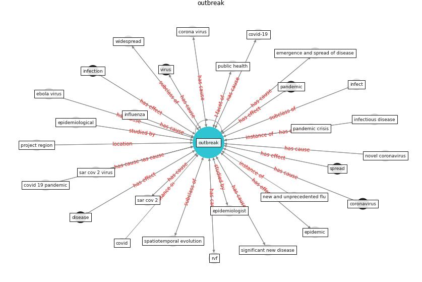

# Keyword: __outbreak__
## Clusters

* Cluster 14: [surveying-drone](cluster_14)

## Concepts

 

## Articles
* afp_rotating_2021 ([afp_rotating_2021](article_afp_rotating_2021))
* A Review on Building Design as a Biomedical
System for Preventing COVID-19 Pandemic ([amran_review_2022](article_amran_review_2022))
* Learning from pandemics: Applying resilience thinking to
identify priorities for planning urban settlements ([syal_learning_2021](article_syal_learning_2021))
* afrin_covid-19_2021 ([afrin_covid-19_2021](article_afrin_covid-19_2021))
* The Socio-Spatial Determinants of COVID-19
Diffusion: The Impact of Globalisation,
Settlement Characteristics and Population ([sigler_socio-spatial_2020](article_sigler_socio-spatial_2020))
* RUDDS_bioRxiv_update-200 ([RUDDS_bioRxiv_update-200](article_RUDDS_bioRxiv_update-200))
* RUDDS_bioRxiv_update-150 ([RUDDS_bioRxiv_update-150](article_RUDDS_bioRxiv_update-150))
* Understanding the role of urban design in disease
spreading ([brizuela_understanding_2019](article_brizuela_understanding_2019))
* Supporting Technologies for COVID-19 Prevention:
Systemized Review ([zhao_supporting_2022](article_zhao_supporting_2022))
* A Comprehensive Review of the COVID-19 Pandemic
and the Role of IoT, Drones, AI, Blockchain, and
5G in Managing its Impact ([chamola_comprehensive_2020](article_chamola_comprehensive_2020))
