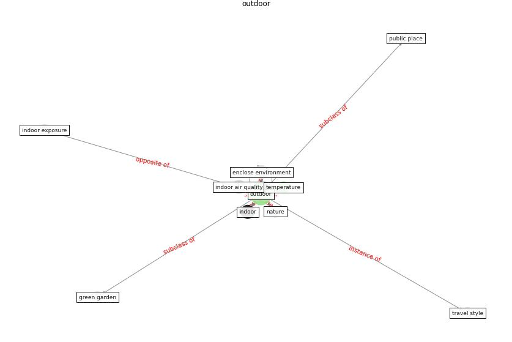

# Keyword: __outdoor__
## Clusters

* Cluster 4: [air-formaldehyde](cluster_4.md)

## Concepts

 

## Articles
* WHO-2019-nCoV-Urban_preparedness-2020 ([WHO-2019-nCoV-Urban_preparedness-2020](article_WHO-2019-nCoV-Urban_preparedness-2020.md))
* The Effect of Opening Windows on Air Change
Rates in Two Homes ([howard-reed_effect_2002](article_howard-reed_effect_2002.md))
* Prophylactic Architecture: Formulating the Concept
of Pandemic-Resilient Homes ([elrayies_prophylactic_2022](article_elrayies_prophylactic_2022.md))
* A Global Survey of Infection Control and
Mitigation Measures for Combating the Transmission
of COVID-19 Pandemic in Buildings Under
Facilities Management Services ([sarvari_global_2022](article_sarvari_global_2022.md))
* Should I Stay or Should I Go? Tourists’
COVID-19 Risk Perception and Vacation Behavior
Shift ([bratic_should_2021](article_bratic_should_2021.md))
* A Global Survey of Infection Control and
Mitigation Measures for Combating the Transmission
of COVID-19 Pandemic in Buildings Under
Facilities Management Services ([sarvari_global_2022](article_sarvari_global_2022.md))
* Designing Post COVID-19 Buildings: Approaches for
Achieving Healthy Buildings ([navaratnam_designing_2022](article_navaratnam_designing_2022.md))
* Prophylactic Architecture: Formulating the Concept
of Pandemic-Resilient Homes ([elrayies_prophylactic_2022](article_elrayies_prophylactic_2022.md))
* 10 Adaptive Measures for Public Places to face the
COVID 19 Pandemic Outbreak ([cheshmehzangi_10_2020](article_cheshmehzangi_10_2020.md))
* realdania_refleksioner_2022_EN-2300 ([realdania_refleksioner_2022_EN-2300](article_realdania_refleksioner_2022_EN-2300.md))
