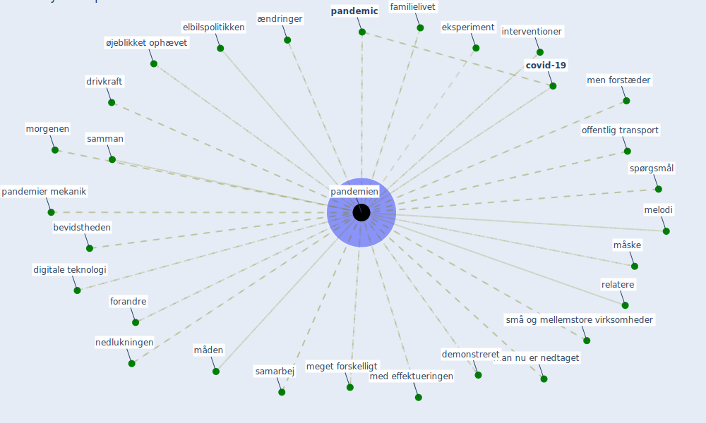

# Keyword: pandemien

## Keywords

 * I at afbøde virkningerne af pandemien, I brug, accelereret kraftigt, adskilte, anledne, anlægsloftet, beslutningstagerne, bevidstheden, bolig og byudvikle, boliger, boligmarkedet, boligområder, boligvalg, brat stopper, bratsberg, brugserfaringerne, brugserfaringerne et strømmet, brugserfaringerne et strømmet ind, bølge, covid 19 pandemien, [covid-19](keyword_covid-19), [danmark](keyword_danmark), danskerne kulturadfærd, [datum](keyword_datum), datum fra og på smartphone, demonstreret, digitale teknologi, disse spørgsmål, drage paralleller mellem pandemien, driver I kontorindretningen, drivkraft, e handel, ejendomme, eksperiment, elbilspolitikken, essaysamle, familielivet, forandre, forbudstid, forskellige, forstærket, fremover, fremtiden, fysiske butik, færr ressourcer, genåbne af samfundet, interventioner, kollektiv trafik, kølvandet, langvarige ophold, løsning, man nu er nedtaget, mange familier, med effektueringen, meget forskelligt, melodi, men forstæder, mexico, morgenen, måden, måske, nedlukningen, niveauet, offentlig transport, omverdenen, opgaverne, oplevelserne, [pandemic](keyword_pandemic), [pandemien](keyword_pandemien), pandemien var en detalje, pandemier mekanik, pandemier mekanik hvordan opstår de hvad er pandemier natur, relatere, respondenterne, samarbej, samman, små og mellemstore virksomheder, som vi har, som vi har set under pandemien, spørgsmål, starten, starten af pandemien klarede de små, status quo, stopper, [stress](keyword_stress), stresseffekter, sydkorea, sygdomsbekæmpelse, tilsyneladende været, [ture](keyword_ture), uderummet, umiddelbare behov, understrege, vaccineret, vaccinestatus, vilkårene, være, ændringer, ærindeturene, øjeblikket ophævet

## Mapping

## Neighbours

### Closest articles

* Refleksioner fra en pandemi - [LINK](article_realdania_refleksioner_2022)
* Pandemiens arkitektur - [LINK](article_realdania_pandemiens_2022)
* What has been the impact of the COVID-19 pandemic on immigrants? An update on recent evidence - [LINK](article_oecd_what_2022)

### Closest BPs

