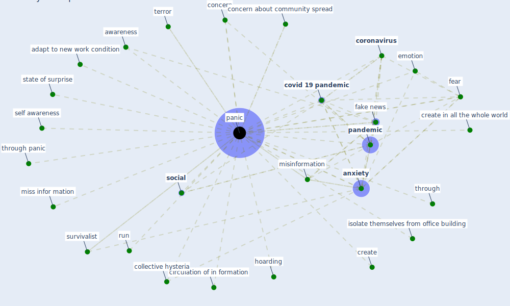

# Keyword: panic

## Keywords

 * adapt to new work condition, [anxiety](keyword_anxiety), awareness, circulation of in formation, collective hysteria, concern, concern about community spread, [coronavirus](keyword_coronavirus), [covid 19 pandemic](keyword_covid_19_pandemic), create, create in all the whole world, emotion, [fake news](keyword_fake_news), fear, hoarding, isolate themselves from office building, [misinformation](keyword_misinformation), miss infor mation, [pandemic](keyword_pandemic), [panic](keyword_panic), panicking, run, self awareness, [social](keyword_social), state of surprise, survivalist, terror, through, through panic

## Mapping

## Neighbours

### Closest articles

* The changes in the effects of social media use of Cypriots due to COVID-19 pandemic - [LINK](article_kaya_changes_2020)
* Pandemic stricken cities on lockdown. Where are our planning and design professionals [now, then and into the future]? - [LINK](article_allam_pandemic_2020)
* How COVID-19 Could Accelerate the Adoption of New Retail Technologies and Enhance the (E-)Servicescape - [LINK](article_willems_how_2021)
* Response to COVID-19 in Taiwan - [LINK](article_wang_response_2020)
* The COVID-19 pandemic: Impacts on cities and major lessons for urban planning, design, and management - [LINK](article_sharifi_covid-19_2020)
* Wastewater surveillance for population-wide Covid-19: The present and future - [LINK](article_daughton_wastewater_2020)
* A critical review of heating, ventilation, and air conditioning (HVAC) systems within the context of a global SARS-CoV-2 epidemic - [LINK](article_elsaid_critical_2021)
* Management of the COVID-19 pandemic: challenges, practices, and organizational support - [LINK](article_hossny_management_2022)
* COVID-ABS: An agent-based model of COVID-19 epidemic to simulate health and economic effects of social distancing interventions - [LINK](article_silva_covid-abs_2020)
* Towards the sustainable development of smart cities through mass video surveillance: A response to the COVID-19 pandemic - [LINK](article_shorfuzzaman_towards_2021)

### Closest BPs

