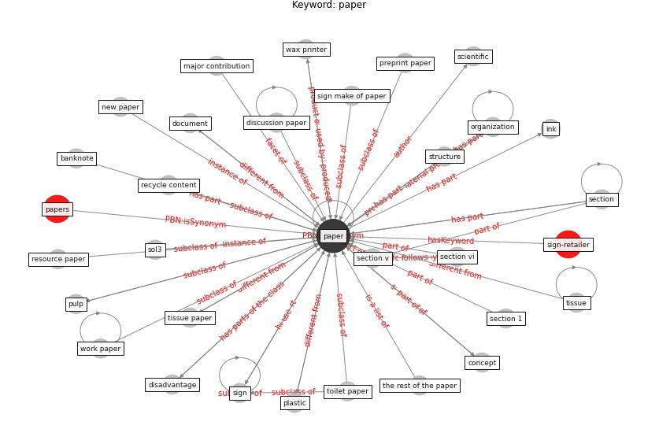

# Keyword: paper

* [sign-retailer](cluster_Cluster_8)

## Keywords

 * Cluster_8, author contribution, banknote, building and environment, cardboard, cloth, concept, disadvantage, discipline, discussion paper, discussion paper 269, document, envelope, ethic statement, forest stewardship council, green press, green press initiative, hepa filter, ink, laminate, major contribution, new paper, newspaper, occasional, organization, [paper](keyword_paper), papers, plastic, plastic sleeve, porous surface, preprint paper, press paper, [printer](keyword_printer), printer paper, pulp, pulp industry, recycle content, research paper, resource paper, retail sign, [sar cov 2](keyword_sar_cov_2), scientific, section, section 1, section v, section vi, [sign](keyword_sign), sign make of paper, sol3, structure, taxonomy, the rest of the paper, the rest of this paper, tissue, tissue paper, toilet paper, wax, wax printer, work paper

## Concepts

 

## Neighbours

### Closest articles

* How COVID-19 Could Accelerate the Adoption of New Retail Technologies and Enhance the (E-)Servicescape - [LINK](article_willems_how_2021)
* Retail Signage During the COVID-19 Pandemic - [LINK](article_mcneish_retail_2020)
* Environmental factors involved in SARS-CoV-2 transmission: effect and role of indoor environmental quality in the strategy for COVID-19 infection control - [LINK](article_azuma_environmental_2020)
* Mapping research in logistics and supply chain management during COVID-19 pandemic - [LINK](article_montoya-torres_mapping_2021)
* Revisiting the built environment: 10 potential development changes and paradigm shifts due to COVID-19 - [LINK](article_cheshmehzangi_revisiting_2021)
* A Comprehensive Review of the COVID-19 Pandemic and the Role of IoT, Drones, AI, Blockchain, and 5G in Managing its Impact - [LINK](article_chamola_comprehensive_2020)
* Supporting Technologies for COVID-19 Prevention: Systemized Review - [LINK](article_zhao_supporting_2022)
* ASHRAE Position Document on Infectious Aerosols - [LINK](article_ashrae_ashrae_2022)
* Graphene-based nanomaterials as antimicrobial surface coatings: A parallel approach to restrain the expansion of COVID-19 - [LINK](article_ayub_graphene-based_2021)
* Urban planning after COVID-19 - [LINK](article_rtpi_urban_2021)

### Closest BPs

