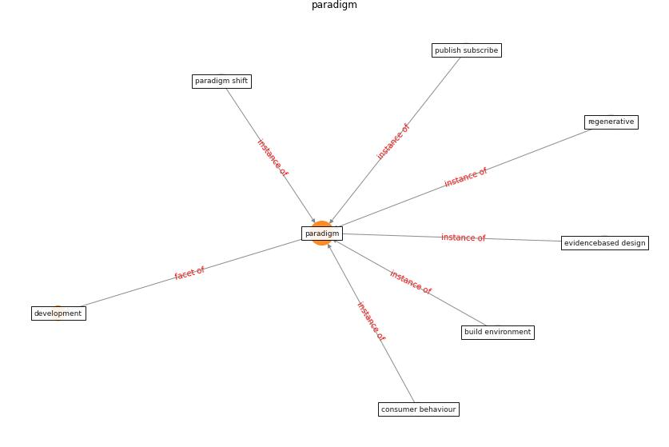

# Keyword: __paradigm__
## Clusters

* Cluster 2: [construction-resilience](cluster_2.md)

## Concepts

 

## Articles
* Navigating Climate Change: Rethinking the Role of
Buildings ([cole_navigating_2020](article_cole_navigating_2020.md))
* Revisiting the built environment: 10 potential development
changes and paradigm shifts due to COVID-19 ([cheshmehzangi_revisiting_2021](article_cheshmehzangi_revisiting_2021.md))
* realdania_refleksioner_2022_EN-3200 ([realdania_refleksioner_2022_EN-3200](article_realdania_refleksioner_2022_EN-3200.md))
* realdania_refleksioner_2022_EN-3150 ([realdania_refleksioner_2022_EN-3150](article_realdania_refleksioner_2022_EN-3150.md))
* Scalable IoT Architecture for Monitoring IEQ
Conditions in Public and Private Buildings ([calvo_scalable_2022](article_calvo_scalable_2022.md))
* Designing a Multi-Agent Occupant Simulation
System to Support Facility Planning and Analysis
for COVID-19 ([lee_designing_2021](article_lee_designing_2021.md))
* nassereddine_propositions_2021-300 ([nassereddine_propositions_2021-300](article_nassereddine_propositions_2021-300.md))
* COVID19: Small and medium enterprises challenges and
responses with creativity, innovation, and
entrepreneurship ([thukral_covid19_2021](article_thukral_covid19_2021.md))
* p15-lee-vor-50 ([p15-lee-vor-50](article_p15-lee-vor-50.md))
* realdania_refleksioner_2022_EN-2300 ([realdania_refleksioner_2022_EN-2300](article_realdania_refleksioner_2022_EN-2300.md))
