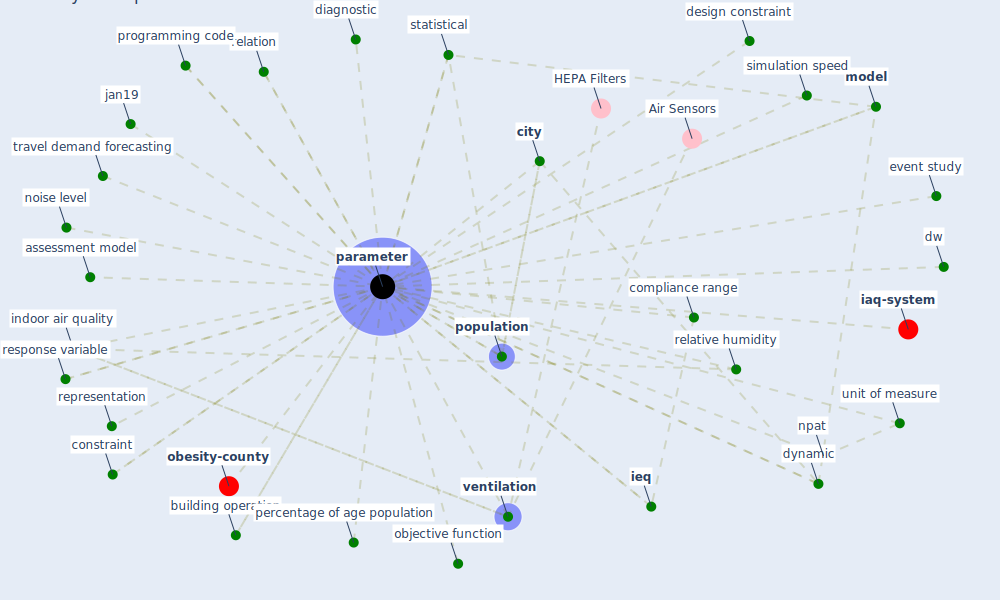

# Keyword: parameter

* [obesity-county](cluster_3)

* [iaq-system](cluster_9)

## Keywords

 * Cluster_3, Cluster_9, [algorithm](keyword_algorithm), assessment model, betweenness centrality, building operation, [city](keyword_city), cold season, [compliance](keyword_compliance), compliance range, [constraint](keyword_constraint), context, convergence, demand, design constraint, diagnostic, dw, dynamic, empirically, [energy consumption](keyword_energy_consumption), evaluation, evaluation process, event study, evolve, iap, [ieq](keyword_ieq), [indoor air quality](keyword_indoor_air_quality), iso 7730, jan19, [mobility](keyword_mobility), [model](keyword_model), noise level, [npat](keyword_npat), [nurse](keyword_nurse), objective function, output parameter, ozone, [parameter](keyword_parameter), parameter graph, parameter graph generation, parameters, percentage of age population, [population](keyword_population), population flow, probability, programming code, relation, relative humidity, representation, response variable, [restriction](keyword_restriction), setting themselves, simulation speed, standard deviation, statistical, subcategorie, [test](keyword_test), travel demand forecasting, tsne, uncertainty, unit of measure, unknown, unknown parameter, [ventilation](keyword_ventilation)

## Mapping

## Neighbours

### Closest articles

* Digital Twin of COVID-19 Mass Vaccination Centers - [LINK](article_pilati_digital_2021)
* An Intelligent IEQ Monitoring and Feedback System: Development and Applications - [LINK](article_geng_intelligent_2021)
* Social distancing enhanced automated optimal design of physical spaces in the wake of the COVID-19 pandemic - [LINK](article_ugail_social_2021)
* Scalable IoT Architecture for Monitoring IEQ Conditions in Public and Private Buildings - [LINK](article_calvo_scalable_2022)
* Treating two pandemics for the price of one: Chronic and infectious disease impacts of the built and natural environment - [LINK](article_frank_treating_2021)
* COVID19-Routes: A Safe Pedestrian Navigation Service - [LINK](article_cantarero_covid19-routes_2021)
* COVID-19 and the rise of intimate partner violence - [LINK](article_aguero_covid-19_2021)
* The effect of occupant distribution on energy consumption and COVID-19 infection in buildings: A case study of university building - [LINK](article_mokhtari_effect_2021)
* COVID-ABS: An agent-based model of COVID-19 epidemic to simulate health and economic effects of social distancing interventions - [LINK](article_silva_covid-abs_2020)
* Association of built environment attributes with the spread of COVID-19 at its initial stage in China - [LINK](article_li_association_2021)

### Closest BPs

