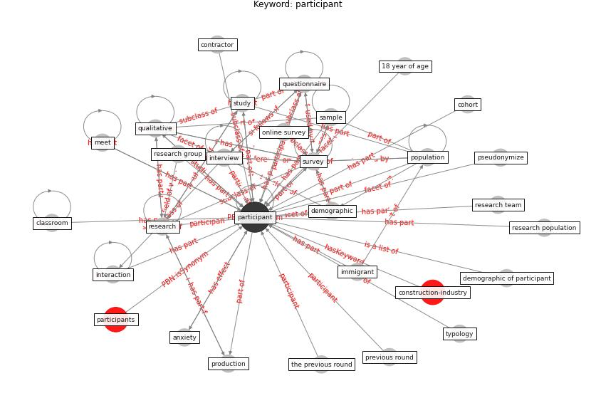

# Keyword: __participant__
## Clusters

* Cluster 9: [construction-project](cluster_9)

## Concepts

 

## Articles
* Psychological Effects of Home Confinement and
Social Distancing Derived from COVID-19 in the
General Population—A Systematic Review ([rodriguez-fernandez_psychological_2021](article_rodriguez-fernandez_psychological_2021))
* A Mixed Approach on Resilience of Spanish
Dwellings and Households during COVID-19 Lockdown ([cuerdo-vilches_mixed_2020](article_cuerdo-vilches_mixed_2020))
* What drives unverified information sharing and
cyberchondria during the COVID-19 pandemic? ([laato_what_2020](article_laato_what_2020))
* The Effects of Pandemic on Construction Industry
in the UK ([shibani_effects_2020](article_shibani_effects_2020))
* realdania_refleksioner_2022_EN ([realdania_refleksioner_2022_EN](article_realdania_refleksioner_2022_EN))
* The Impact of Pandemic Crisis on the Survival of
Construction Industry: A Case of COVID-19 ([gamil_impact_2020](article_gamil_impact_2020))
* ogunnusi_covid-19_2020 ([ogunnusi_covid-19_2020](article_ogunnusi_covid-19_2020))
* Using Technology to Maintain the Education of
Residents During the COVID-19 Pandemic ([chick_using_2020](article_chick_using_2020))
* Should I Stay or Should I Go? Tourists’
COVID-19 Risk Perception and Vacation Behavior
Shift ([bratic_should_2021](article_bratic_should_2021))
* Mental health economics: A prospective study on
psychological flourishing and associations with healthcare
costs and sickness benefit transfers in Denmark ([santini_mental_2021](article_santini_mental_2021))
