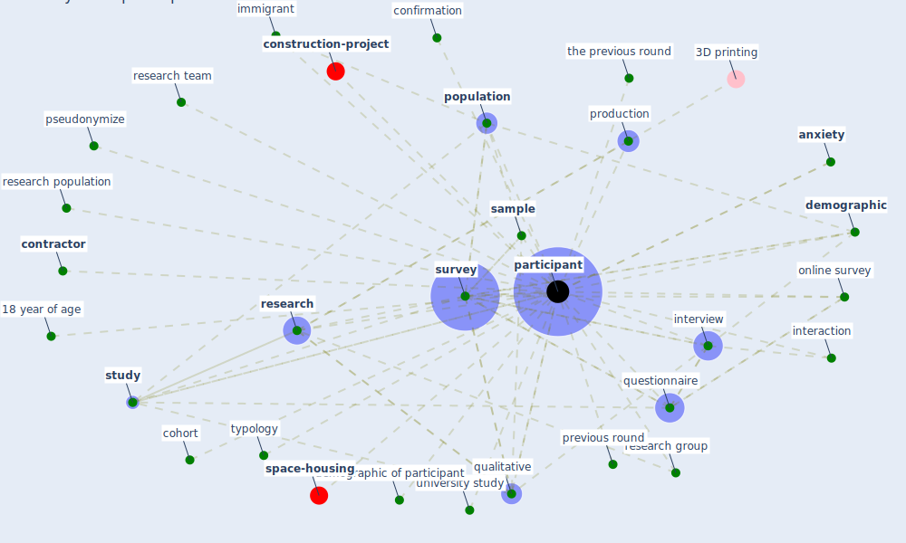

# Keyword: participant

* [respiratory-infection](cluster_3)

## Keywords

 * 18 year of age, Cluster_3, [anxiety](keyword_anxiety), audience, author typology, classroom, [cohort](keyword_cohort), confirmation, [contractor](keyword_contractor), demographic, demographic of participant, [immigrant](keyword_immigrant), [interaction](keyword_interaction), interview, online survey, [participant](keyword_participant), participants, [population](keyword_population), previous round, production, pseudonymize, [qualitative](keyword_qualitative), questionnaire, [research](keyword_research), research group, research population, research team, [sample](keyword_sample), [study](keyword_study), [survey](keyword_survey), the previous round, typology, university study, yes no question

## Mapping

## Neighbours

### Closest articles

* A Mixed Approach on Resilience of Spanish Dwellings and Households during COVID-19 Lockdown - [LINK](article_cuerdo-vilches_mixed_2020)
* Psychological Effects of Home Confinement and Social Distancing Derived from COVID-19 in the General Population—A Systematic Review - [LINK](article_rodriguez-fernandez_psychological_2021)
* What drives unverified information sharing and cyberchondria during the COVID-19 pandemic? - [LINK](article_laato_what_2020)
* The Impact of Pandemic Crisis on the Survival of Construction Industry: A Case of COVID-19 - [LINK](article_gamil_impact_2020)
* The Effects of Pandemic on Construction Industry in the UK - [LINK](article_shibani_effects_2020)
* Knowledge, attitudes, and practices of Indonesian residents regarding COVID-19: A national cross-sectional survey - [LINK](article_yodang_knowledge_2021)
* COVID-19 pandemic: the effects and prospects in the construction industry. - [LINK](article_ogunnusi_covid-19_2020)
* Using Technology to Maintain the Education of Residents During the COVID-19 Pandemic - [LINK](article_chick_using_2020)
* Should I Stay or Should I Go? Tourists’ COVID-19 Risk Perception and Vacation Behavior Shift - [LINK](article_bratic_should_2021)
* Mental health economics: A prospective study on psychological flourishing and associations with healthcare costs and sickness benefit transfers in Denmark - [LINK](article_santini_mental_2021)

### Closest BPs

