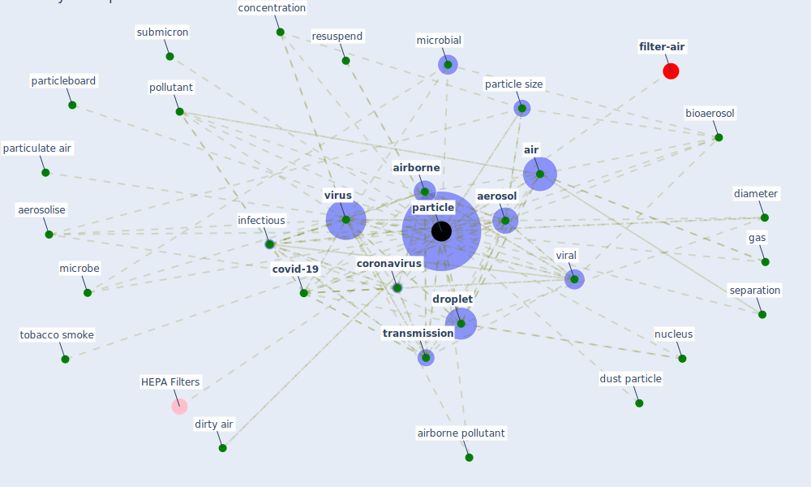

# Keyword: particle

* [filter-air](cluster_0)

## Keywords

 * 0 3 m, 10 μm, Cluster_0, HEPA Filters, [aerosol](keyword_aerosol), aerosolise, [air](keyword_air), [air filter](keyword_air_filter), [airborne](keyword_airborne), airborne pollutant, airflow, [bacteria](keyword_bacteria), ballistic droplet, [bioaerosol](keyword_bioaerosol), carpet, concentration, [coronavirus](keyword_coronavirus), cough, [covid-19](keyword_covid-19), deactivate, diameter, dirty air, [droplet](keyword_droplet), droplet nuclei, dust particle, [filter](keyword_filter), gas, hepa, hepa system, hygroscopic, indoor air, infectious, mass, microbe, [microbial](keyword_microbial), [noise](keyword_noise), nuclei, nucleus, ozone, [particle](keyword_particle), particle separation, particle size, particle size distribution, particleboard, particles, particulate, particulate air, [pathogen](keyword_pathogen), [pollutant](keyword_pollutant), pore, protein, range, resuspend, separation, small particle, submicron, [tleuken](keyword_tleuken), tobacco smoke, [transmission](keyword_transmission), transmission distance, ultrafine, [viral](keyword_viral), [virus](keyword_virus), [water](keyword_water)

## Mapping

## Neighbours

### Closest articles

* A critical review of heating, ventilation, and air conditioning (HVAC) systems within the context of a global SARS-CoV-2 epidemic - [LINK](article_elsaid_critical_2021)
* The ventilation of buildings and other mitigating measures for COVID-19: a focus on wintertime - [LINK](article_burridge_ventilation_2021)
* 2019 Novel Coronavirus (COVID-19) Pandemic: Built Environment Considerations To Reduce Transmission - [LINK](article_dietz_2019_2020)
* Environmental factors involved in SARS-CoV-2 transmission: effect and role of indoor environmental quality in the strategy for COVID-19 infection control - [LINK](article_azuma_environmental_2020)
* The effect of occupant distribution on energy consumption and COVID-19 infection in buildings: A case study of university building - [LINK](article_mokhtari_effect_2021)
* COVID-19 Could Leverage a Sustainable Built Environment - [LINK](article_pinheiro_covid-19_2020)
* Effect of Ultraviolet Germicidal Irradiation on Viral Aerosols - [LINK](article_walker_effect_2007)
* Methods for air cleaning and protection of building occupants from airborne pathogens - [LINK](article_bolashikov_methods_2009)
* A Review on Building Design as a Biomedical System for Preventing COVID-19 Pandemic - [LINK](article_amran_review_2022)
* The efficacy of social distance and ventilation effectiveness in preventing COVID-19 transmission - [LINK](article_sun_efficacy_2020)

### Closest BPs

