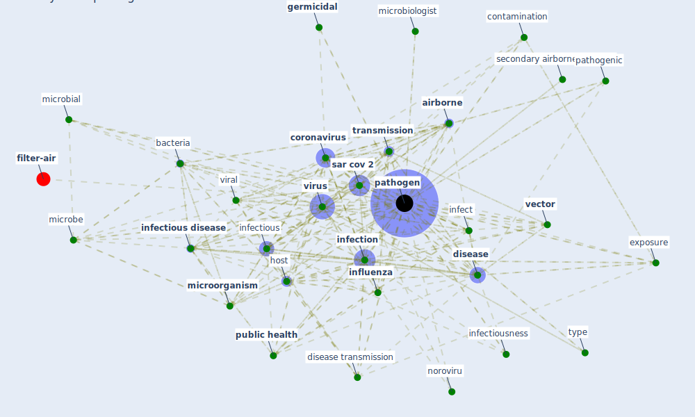

# Keyword: pathogen

* [wastewater-water](cluster_0)

## Keywords

 * [aerosol](keyword_aerosol), [agent](keyword_agent), [air](keyword_air), [airborne](keyword_airborne), airborne transmission, antibacterial, [antimicrobial](keyword_antimicrobial), autoimmune, automatic cleaning, avian influenza, [bacteria](keyword_bacteria), bacterial, [bioaerosol](keyword_bioaerosol), [biodiversity](keyword_biodiversity), communicable, contact surface, contaminant, contaminate, [contamination](keyword_contamination), [coronavirus](keyword_coronavirus), court yard approach, cross infection, deactivate they, [disease](keyword_disease), disease emergence, disease transmission, drink water, drink water contamination, [droplet](keyword_droplet), efficient, emerge infectious disease, enteric, [epidemic](keyword_epidemic), exhale, [exposure](keyword_exposure), [germicidal](keyword_germicidal), health burden, hepatitis a virus, host, inactivate, [infect](keyword_infect), [infection](keyword_infection), [infectious](keyword_infectious), [infectious disease](keyword_infectious_disease), infectiousness, infector, [influenza](keyword_influenza), innate immune response, interspecific, [malaria](keyword_malaria), [mer cov](keyword_mer_cov), microbe, [microbial](keyword_microbial), microbiologist, microbiology, [microorganism](keyword_microorganism), non pathogen, noroviru, nosocomial, organism, [pandemic](keyword_pandemic), parasite, [pathogen](keyword_pathogen), pathogen inactivation, pathogen laden droplet, pathogen sequence, pathogenesis, pathogenic, pathogenic bacteria, polio virus, [pollutant](keyword_pollutant), pollute particle, propagation, [public health](keyword_public_health), [quarantine](keyword_quarantine), remote control automatic cleaning, remove, resistance gene, respiratory disease, [sar cov 2](keyword_sar_cov_2), secondary airborne infection, streptococcus pyogene, [sunlight](keyword_sunlight), tick borne encephalitis virus, tissue, transfer, [transmission](keyword_transmission), transmit, [transport](keyword_transport), [tuberculosis](keyword_tuberculosis), [type](keyword_type), unintentionally introduce, [vector](keyword_vector), [viral](keyword_viral), virologist, virulence, [virus](keyword_virus), [wastewater](keyword_wastewater), zoonotic, zoonotic disease

## Mapping

## Neighbours

### Closest articles

* Methods for air cleaning and protection of building occupants from airborne pathogens - [LINK](article_bolashikov_methods_2009)
* Learning from pandemics: Applying resilience thinking to identify priorities for planning urban settlements - [LINK](article_syal_learning_2021)
* ASHRAE Position Document on Infectious Aerosols - [LINK](article_ashrae_ashrae_2022)
* Future perspectives of wastewater-based epidemiology: Monitoring infectious disease spread and resistance to the community level - [LINK](article_sims_future_2020)
* Readiness Assessment of Green Building Certification Systems for Residential Buildings during Pandemics - [LINK](article_tleuken_readiness_2021)
* COVID-19 Could Leverage a Sustainable Built Environment - [LINK](article_pinheiro_covid-19_2020)
* Designing Post COVID-19 Buildings: Approaches for Achieving Healthy Buildings - [LINK](article_navaratnam_designing_2022)
* Making green infrastructure healthier infrastructure - [LINK](article_lohmus_making_2015)
* Applications of ultraviolet germicidal irradiation disinfection in health care facilities: Effective adjunct, but not stand-alone technology - [LINK](article_memarzadeh_applications_2010)
* Indoor Air Quality: Rethinking rules of building design strategies in post-pandemic architecture - [LINK](article_megahed_indoor_2021)

### Closest BPs

