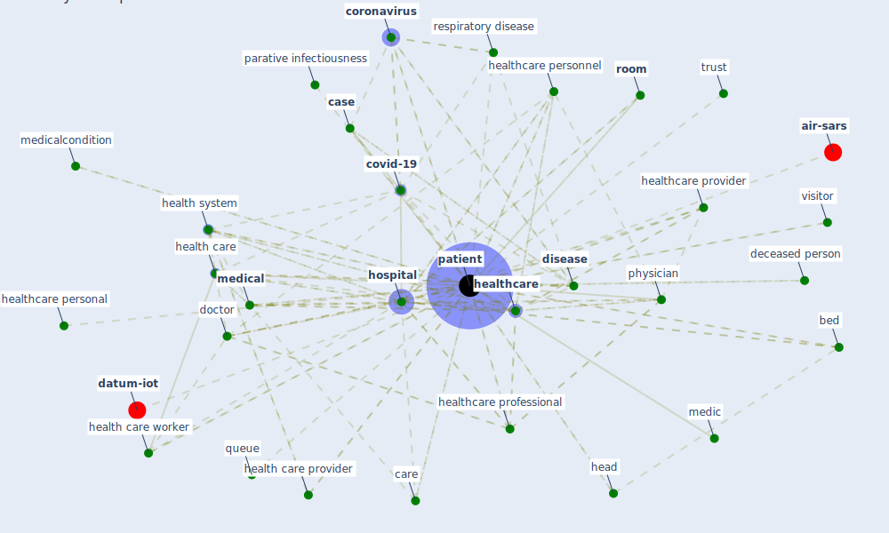

# Keyword: patient

* [wastewater-water](cluster_0)

* [iot-blockchain](cluster_7)

* [design-ventilation](cluster_10)

* [air-uv](cluster_12)

## Keywords

 * Cluster_0, Cluster_10, Cluster_12, Cluster_7, activation, anamnesis, anonymous, arrival, bed, [care](keyword_care), care team, caregiver, [case](keyword_case), civilian, [cohort](keyword_cohort), [coronavirus](keyword_coronavirus), [corridor](keyword_corridor), [covid-19](keyword_covid-19), datum collection, datum point, day care, deceased person, [disease](keyword_disease), doctor, [domain](keyword_domain), entity, gp, head, health and welfare professional, [health care](keyword_health_care), health care provider, health care worker, health expert, health personnel, health provider, [health system](keyword_health_system), [healthcare](keyword_healthcare), healthcare personal, healthcare personnel, healthcare professional, healthcare provider, healthcare sector, healthcare worker, [home](keyword_home), [hospital](keyword_hospital), [information](keyword_information), insurance coverage, medic, [medical](keyword_medical), medicalcondition, [nurse](keyword_nurse), outcome, palliative care unit, parative infectiousness, [patient](keyword_patient), patient test result, patients, physician, pressure room, queue, [relationship](keyword_relationship), [research](keyword_research), respiratory disease, respiratory tract, [room](keyword_room), saf, saf j infect, [safety](keyword_safety), spatial, spatialpatient, [study](keyword_study), tele surgery, track, track every movement, travel history, trust, ventilatory assistance, visitor, [ward](keyword_ward), [wellbee](keyword_wellbee), [worker](keyword_worker)

## Mapping

## Neighbours

### Closest articles

* Supporting Technologies for COVID-19 Prevention: Systemized Review - [LINK](article_zhao_supporting_2022)
* A Global Survey of Infection Control and Mitigation Measures for Combating the Transmission of COVID-19 Pandemic in Buildings Under Facilities Management Services - [LINK](article_sarvari_global_2022)
* Digital Twin of COVID-19 Mass Vaccination Centers - [LINK](article_pilati_digital_2021)
* Toilets dominate environmental detection of SARS-CoV-2 virus in a hospital - [LINK](article_ding_toilets_2020)
* An Overview of Biomedical Ontologies for Pandemics and Infectious Diseases Representation - [LINK](article_bayoudhi_overview_2021)
* Strengthening resilience: a priority shared by Health 2020 and - [LINK](article_who_strengthening_2017)
* A Comprehensive Review of the COVID-19 Pandemic and the Role of IoT, Drones, AI, Blockchain, and 5G in Managing its Impact - [LINK](article_chamola_comprehensive_2020)
* How COVID-19 Could Accelerate the Adoption of New Retail Technologies and Enhance the (E-)Servicescape - [LINK](article_willems_how_2021)
* Architectural design strategies for infection prevention and control (IPC) in health-care facilities: towards curbing the spread of Covid-19 \textbar SpringerLink - [LINK](article_udomiaye_architectural_2020)
* The role of 5G for digital healthcare against COVID-19 pandemic: Opportunities and challenges - [LINK](article_siriwardhana_role_2021)

### Closest BPs

