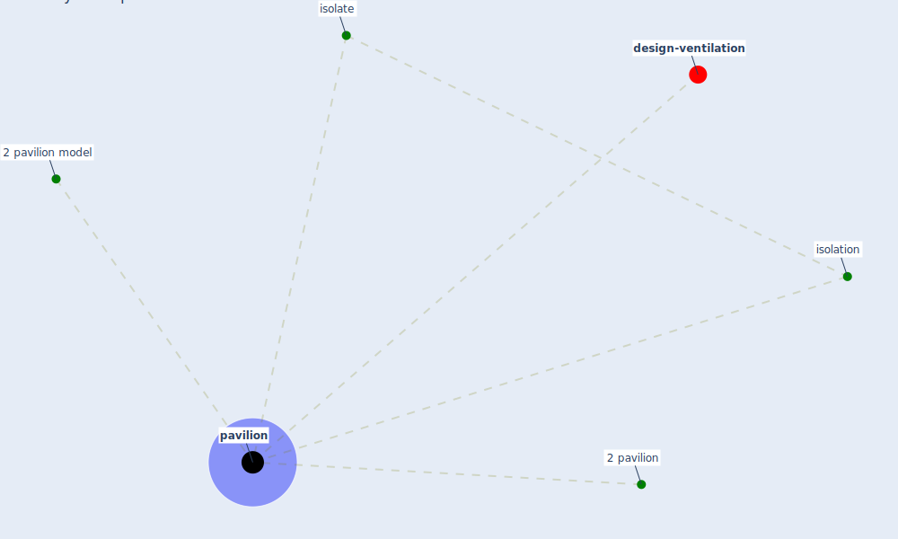

# Keyword: pavilion

* [design-ventilation](cluster_12)

## Keywords

 * 2 pavilion, 2 pavilion model, Cluster_12, isolate, isolation, [pavilion](keyword_pavilion), pavilions

## Mapping

## Neighbours

### Closest articles

* Architectural design strategies for infection prevention and control (IPC) in health-care facilities: towards curbing the spread of Covid-19 \textbar SpringerLink - [LINK](article_udomiaye_architectural_2020)
* A Review on Building Design as a Biomedical System for Preventing COVID-19 Pandemic - [LINK](article_amran_review_2022)

### Closest BPs

