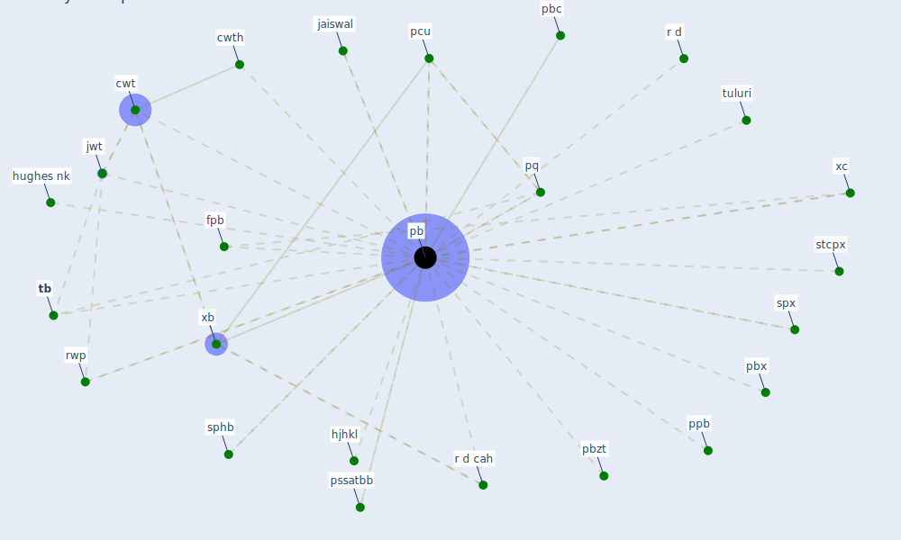

# Keyword: pb

## Keywords

 * [cwt](keyword_cwt), cwth, fpb, hjhkl, hughes nk, jaiswal, [jwt](keyword_jwt), [pb](keyword_pb), pbc, pbx, pbzt, [pcu](keyword_pcu), ppb, pq, pssatbb, r d, r d cah, rwp, sphb, spx, stcpx, [tb](keyword_tb), tuluri, xb, xc

## Mapping

## Neighbours

### Closest articles

* A Platform for Citizen Cooperation during the COVID-19 Pandemic in RN, Brazil - [LINK](article_de_araujo_platform_2020)
* Pandemic Analytics: How Countries are Leveraging Big Data Analytics and Artificial Intelligence to Fight COVID-19? - [LINK](article_mehta_pandemic_2021)
* Making green infrastructure healthier infrastructure - [LINK](article_lohmus_making_2015)
* Scalable IoT Architecture for Monitoring IEQ Conditions in Public and Private Buildings - [LINK](article_calvo_scalable_2022)
* A comprehensive review on indoor air quality monitoring systems for enhanced public health - [LINK](article_saini_comprehensive_2020)

### Closest BPs

