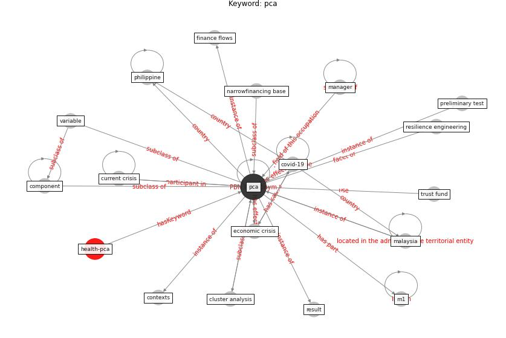

# Keyword: pca

* [economic-health](cluster_Cluster_9)

## Keywords

 * Cluster_9, cluster analysis, component, contexts, [covid-19](keyword_covid-19), current crisis, [economic crisis](keyword_economic_crisis), finance flows, m1, [malaysia](keyword_malaysia), [manager](keyword_manager), narrowfinancing base, [pca](keyword_pca), philippine, preliminary test, resilience engineering, result, trust fund, variable

## Concepts

 

## Neighbours

### Closest articles

* Building sustainable finance for resilient protected and conserved areas: lessons from COVID-19 - [LINK](article_cumming_building_2021)
* COVID-19 and regional solutions for mitigating the risk of SME finance in selected ASEAN member states - [LINK](article_taghizadeh-hesary_covid-19_2022)
* A review of definitions and measures of system resilience - [LINK](article_hosseini_review_2016)

### Closest BPs

