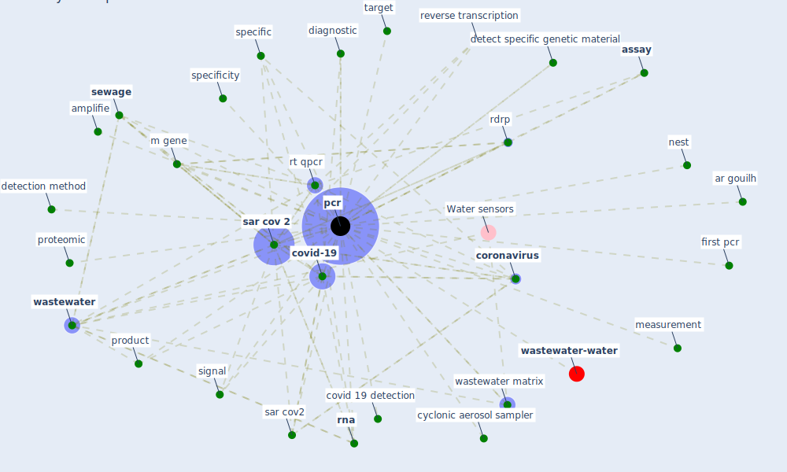

# Keyword: pcr

* [wastewater-water](cluster_0)

## Keywords

 * 440 ar gouilh, Cluster_0, amplifie, analytical, antibody, ar gouilh, [assay](keyword_assay), cell culture, chain reaction, contaminant, [coronavirus](keyword_coronavirus), covid 19 detection, covid 19 outbreak, [covid-19](keyword_covid-19), cyclonic aerosol sampler, detect specific genetic material, detection method, [diagnosis](keyword_diagnosis), diagnostic, diagnostic detection, [digital](keyword_digital), gel electrophoresis, [gene](keyword_gene), m gene, mean, measurement, nest, nest pcr, pandemic wave interval, [pcr](keyword_pcr), pcr product, pcr unit, product, promoter, proteomic, qrt, rdrp, reverse transcription, [rna](keyword_rna), rt qpcr, [sar cov 2](keyword_sar_cov_2), sar cov 2 rdrp, [sar cov2](keyword_sar_cov2), sd, [sewage](keyword_sewage), signal, specific, specificity, target, tendency, [wastewater](keyword_wastewater), wastewater matrix, first pcr

## Mapping

## Neighbours

### Closest articles

* Detection of SARS-CoV-2 in raw and treated wastewater in Germany – Suitability for COVID-19 surveillance and potential transmission risks - [LINK](article_westhaus_detection_2021)
* Wastewater-Based Epidemiology to monitor COVID-19 outbreak: Present and future diagnostic methods to be in your radar - [LINK](article_barcelo_wastewater-based_2020)
* SARS-CoV-2 Titers in Wastewater Are Higher than Expected from Clinically Confirmed Cases - [LINK](article_wu_sars-cov-2_2020)
* First detection of SARS-CoV-2 in untreated wastewaters in Italy - [LINK](article_la_rosa_first_2020)
* An environmental and health perspective for COVID-19 outbreak: Meteorology and air quality influence, sewage epidemiology indicator, hospitals disinfection, drug therapies and recommendations - [LINK](article_barcelo_environmental_2020)
* First confirmed detection of SARS-CoV-2 in untreated wastewater in Australia: A proof of concept for the wastewater surveillance of COVID-19 in the community - [LINK](article_ahmed_first_2020)
* COVID-19 Pandemic: Prevention and Protection Measures to Be Adopted at the Workplace - [LINK](article_cirrincione_covid-19_2020)
* COVID-19: Risk assessment and mitigation measures in healthcare and non-healthcare workplaces - [LINK](article_fawzy_covid-19_2021)
* COVID-19 Prevention and Control Measures in Workplace Settings: A Rapid Review and Meta-Analysis - [LINK](article_ingram_covid-19_2021)
* SARS-CoV-2 RNA detection of hospital isolation wards hygiene monitoring during the Coronavirus Disease 2019 outbreak in a Chinese hospital - [LINK](article_wang_sars-cov-2_2020)

### Closest BPs

