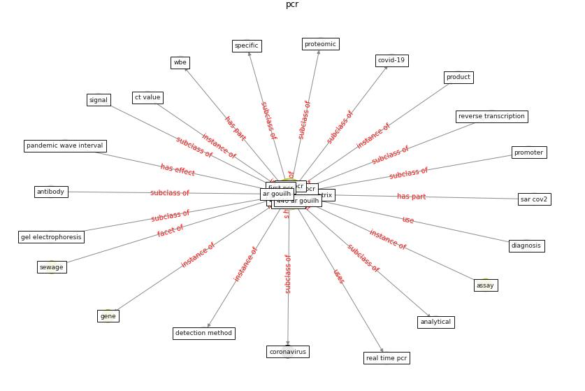

# Keyword: __pcr__
## Clusters

* Cluster 12: [wastewater-sars](cluster_12)

## Concepts

 

## Top 10 articles for __pcr__
* Detection of SARS-CoV-2 in raw and treated wastewater
in Germany – Suitability for COVID-19 surveillance
and potential transmission risks ([westhaus_detection_2021](article_westhaus_detection_2021))
* Wastewater-Based Epidemiology to monitor COVID-19
outbreak: Present and future diagnostic methods to be in
your radar ([barcelo_wastewater-based_2020](article_barcelo_wastewater-based_2020))
* SARS-CoV-2 Titers in Wastewater Are Higher
than Expected from Clinically Confirmed Cases ([wu_sars-cov-2_2020](article_wu_sars-cov-2_2020))
* First detection of SARS-CoV-2 in untreated wastewaters
in Italy ([la_rosa_first_2020](article_la_rosa_first_2020))
* An environmental and health perspective for COVID-19
outbreak: Meteorology and air quality influence, sewage
epidemiology indicator, hospitals disinfection, drug
therapies and recommendations ([barcelo_environmental_2020](article_barcelo_environmental_2020))
* First confirmed detection of SARS-CoV-2 in untreated
wastewater in Australia: A proof of concept for the
wastewater surveillance of COVID-19 in the community ([ahmed_first_2020](article_ahmed_first_2020))
* hseie_algorithms_2021 ([hseie_algorithms_2021](article_hseie_algorithms_2021))
* COVID-19 Prevention and Control Measures in
Workplace Settings: A Rapid Review and
Meta-Analysis ([ingram_covid-19_2021](article_ingram_covid-19_2021))
* SARS-CoV-2 RNA detection of hospital isolation wards
hygiene monitoring during the Coronavirus Disease 2019
outbreak in a Chinese hospital ([wang_sars-cov-2_2020](article_wang_sars-cov-2_2020))
* Computational analysis of SARS-CoV-2/COVID-19
surveillance by wastewater-based epidemiology locally and
globally: Feasibility, economy, opportunities and
challenges ([hart_computational_2020](article_hart_computational_2020))
