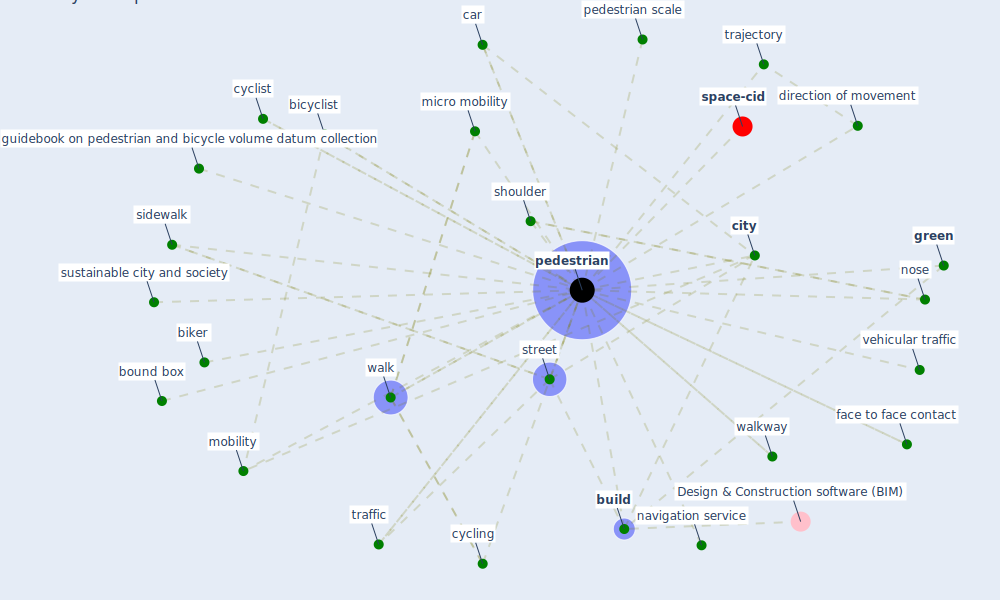

# Keyword: pedestrian

* [space-cid](cluster_2)

## Keywords

 * Cluster_2, bicyclist, biker, [bound box](keyword_bound_box), [build](keyword_build), car, [city](keyword_city), [cycling](keyword_cycling), cyclist, direction of movement, face to face contact, [green](keyword_green), guidebook on pedestrian and bicycle volume datum collection, micro mobility, [mobility](keyword_mobility), navigation service, nose, [pedestrian](keyword_pedestrian), pedestrian scale, pedestrians, shoulder, sidewalk, street, sustainable city and society, [traffic](keyword_traffic), trajectory, vehicular traffic, walk, walkway

## Mapping

## Neighbours

### Closest articles

* Urban planning after COVID-19 - [LINK](article_rtpi_urban_2021)
* Impact of Covid-19 on the built environment - [LINK](article_mahima_impact_2022)
* EXPOSED: An occupant exposure model for confined spaces to retrofit crowd models during a pandemic - [LINK](article_ronchi_exposed_2020)
* Towards the sustainable development of smart cities through mass video surveillance: A response to the COVID-19 pandemic - [LINK](article_shorfuzzaman_towards_2021)
* The Impact of COVID-19 on Public Space: A Review of the Emerging Questions - [LINK](article_honey-roses_impact_2020)
* Smart cities and a data-driven response to COVID-19 - [LINK](article_james_smart_2020)
* COVID19-Routes: A Safe Pedestrian Navigation Service - [LINK](article_cantarero_covid19-routes_2021)
* Treating two pandemics for the price of one: Chronic and infectious disease impacts of the built and natural environment - [LINK](article_frank_treating_2021)
* How the Coronavirus Will Reshape Architecture - [LINK](article_chayka_how_2020)
* COVID-19 and Green Housing: A Review of Relevant Literature - [LINK](article_kaklauskas_covid-19_2021)

### Closest BPs

