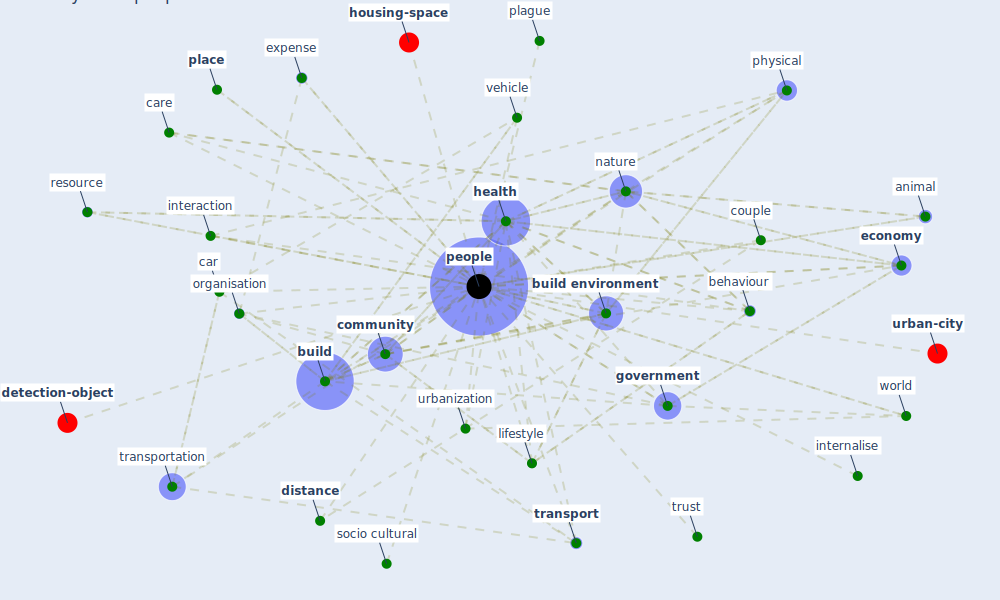

# Keyword: people

* [health-city](cluster_1)

* [space-housing](cluster_2)

* [building-design](cluster_4)

* [iot-blockchain](cluster_5)

* [space-cid](cluster_7)

## Keywords

 * Cluster_1, Cluster_2, Cluster_4, Cluster_5, Cluster_7, [activity](keyword_activity), animal, behaviour, [build](keyword_build), [build environment](keyword_build_environment), car, [care](keyword_care), [city](keyword_city), [community](keyword_community), competition, concrete, [country](keyword_country), couple, distance, [economy](keyword_economy), [ecosystem](keyword_ecosystem), expense, [firm](keyword_firm), first nation, good, [government](keyword_government), group, [health](keyword_health), [home](keyword_home), institution, [interaction](keyword_interaction), internalise, lifestyle, livelihood, low income job, [nature](keyword_nature), [neighborhood](keyword_neighborhood), nursing home, [office](keyword_office), [organisation](keyword_organisation), [pandemic](keyword_pandemic), pandemic process, [people](keyword_people), peoples, [physical](keyword_physical), place, plague, plague and people, posture, prime minister, [public place](keyword_public_place), [quarantine](keyword_quarantine), resource, safe place, socio cultural, tall building, [transport](keyword_transport), [transportation](keyword_transportation), trust, urbanization, vehicle, world

## Mapping

## Neighbours

### Closest articles

* Health, Wellbeing \& Productivity in Offices - [LINK](article_world_green_building_council_health_2014)
* How COVID-19 Could Accelerate the Adoption of New Retail Technologies and Enhance the (E-)Servicescape - [LINK](article_willems_how_2021)
* Navigating Climate Change: Rethinking the Role of Buildings - [LINK](article_cole_navigating_2020)
* COVID19-Routes: A Safe Pedestrian Navigation Service - [LINK](article_cantarero_covid19-routes_2021)
* COVID-19 Could Leverage a Sustainable Built Environment - [LINK](article_pinheiro_covid-19_2020)
* The City Under COVID‐19: Podcasting As Digital Methodology - [LINK](article_rogers_city_2020)
* Emerging Technologies to Combat the COVID-19 Pandemic - [LINK](article_vaishya_emerging_2020)
* COVID-ABS: An agent-based model of COVID-19 epidemic to simulate health and economic effects of social distancing interventions - [LINK](article_silva_covid-abs_2020)
* DeepSOCIAL: Social Distancing Monitoring and Infection Risk Assessment in COVID-19 Pandemic - [LINK](article_rezaei_deepsocial_2020)

### Closest BPs

