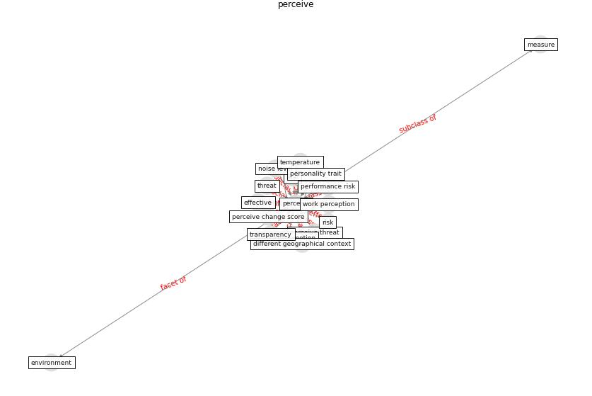

# Keyword: __perceive__
## Clusters

* Cluster 7: [tourism-tourist](cluster_7)

## Concepts

 

## Top 10 articles for __perceive__
* Exploring the Non-Medical impacts of Covid-19 using
Natural Language Processing ([agade_exploring_2020](article_agade_exploring_2020))
* Seeing the invisible hand: Underlying effects of
COVID-19 on tourists’ behavioral patterns ([li_seeing_2020](article_li_seeing_2020))
* Home garden use during COVID-19: Associations with
physical and mental wellbeing in older adults ([corley_home_2021](article_corley_home_2021))
* The Intelligent Lockdown: Compliance with COVID-19
Mitigation Measures in the Netherlands ([kuiper_intelligent_2020](article_kuiper_intelligent_2020))
* Green in times of COVID-19: urban green space relevance
during the COVID-19 pandemic in Buenos Aires City ([marconi_green_2022](article_marconi_green_2022))
* realdania_refleksioner_2022_EN ([realdania_refleksioner_2022_EN](article_realdania_refleksioner_2022_EN))
* How COVID-19 Could Accelerate the Adoption of
New Retail Technologies and Enhance the
(E-)Servicescape ([willems_how_2021](article_willems_how_2021))
* Should I Stay or Should I Go? Tourists’
COVID-19 Risk Perception and Vacation Behavior
Shift ([bratic_should_2021](article_bratic_should_2021))
* Attitudes towards outdoor and neighbour noise during the
COVID-19 lockdown: A case study in London ([lee_attitudes_2021](article_lee_attitudes_2021))
* Retail Signage During the COVID-19 Pandemic ([mcneish_retail_2020](article_mcneish_retail_2020))
