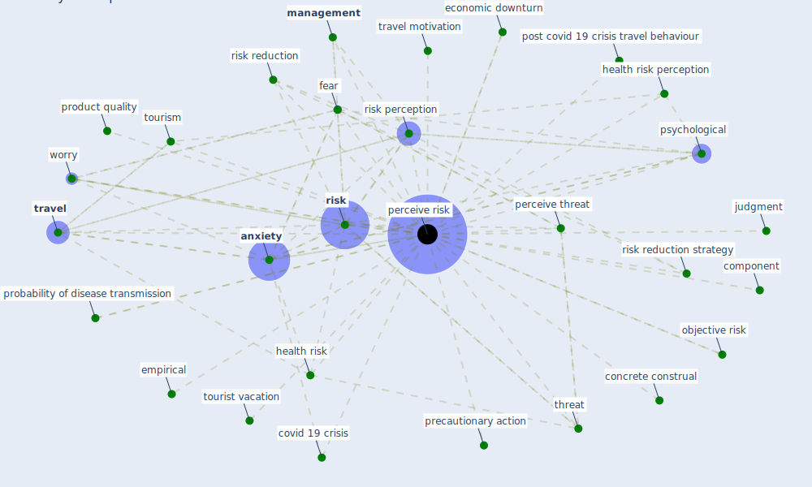

# Keyword: perceive risk

## Keywords

 * [anxiety](keyword_anxiety), component, concrete construal, [covid 19 crisis](keyword_covid_19_crisis), economic downturn, empirical, fear, health risk, health risk perception, judgment, [management](keyword_management), management of perceive risk, non participation, objective risk, [perceive risk](keyword_perceive_risk), perceive threat, perceived risk, perceived risks, post covid 19 crisis travel behaviour, precautionary action, probability of disease transmission, product quality, [psychological](keyword_psychological), [risk](keyword_risk), [risk perception](keyword_risk_perception), risk reduction, risk reduction strategy, threat, [tourism](keyword_tourism), tourist vacation, [travel](keyword_travel), travel motivation, worry

## Mapping

## Neighbours

### Closest articles

* Seeing the invisible hand: Underlying effects of COVID-19 on tourists’ behavioral patterns - [LINK](article_li_seeing_2020)
* Should I Stay or Should I Go? Tourists’ COVID-19 Risk Perception and Vacation Behavior Shift - [LINK](article_bratic_should_2021)
* How COVID-19 Could Accelerate the Adoption of New Retail Technologies and Enhance the (E-)Servicescape - [LINK](article_willems_how_2021)
* The impacts of knowledge, risk perception, emotion and information on citizens’ protective behaviors during the outbreak of COVID-19: a cross-sectional study in China - [LINK](article_ning_impacts_2020)
* Mobility Behaviour in View of the Impact of the COVID-19 Pandemic—Public Transport Users in Gdansk Case Study - [LINK](article_przybylowski_mobility_2021)

### Closest BPs

