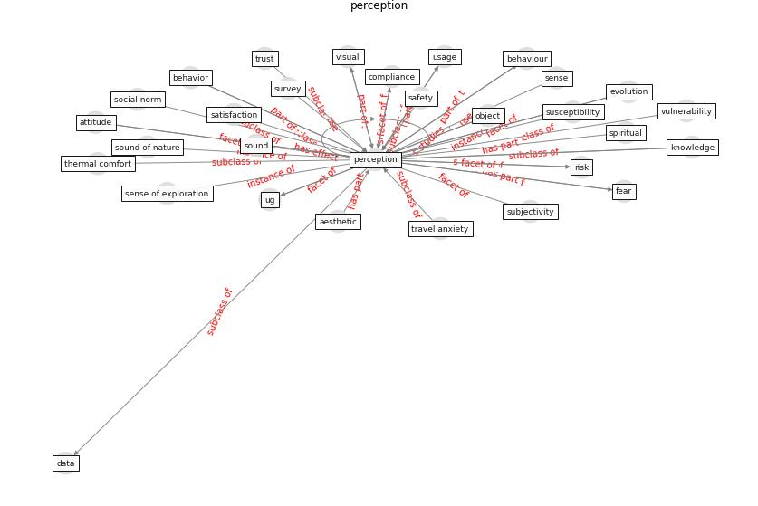

# Keyword: __perception__
## Clusters

* Cluster 7: [tourism-tourist](cluster_7)
* Cluster 15: [green-urban](cluster_15)

## Concepts

 

## Top 10 articles for __perception__
* Perception of COVID-19 impacts on the construction
industry over time ([rokooei_perception_2022](article_rokooei_perception_2022))
* Green in times of COVID-19: urban green space relevance
during the COVID-19 pandemic in Buenos Aires City ([marconi_green_2022](article_marconi_green_2022))
* The impacts of knowledge, risk perception, emotion and
information on citizens’ protective behaviors during the
outbreak of COVID-19: a cross-sectional study in
China ([ning_impacts_2020](article_ning_impacts_2020))
* Effects of the COVID-19 pandemic on the use and
perceptions of urban green space: An international
exploratory study ([ugolini_effects_2020](article_ugolini_effects_2020))
* How COVID-19 Could Accelerate the Adoption of
New Retail Technologies and Enhance the
(E-)Servicescape ([willems_how_2021](article_willems_how_2021))
* The Impact of COVID-19 on Public Space: A
Review of the Emerging Questions ([honey-roses_impact_2020](article_honey-roses_impact_2020))
* world_green_building_council_health_2014 ([world_green_building_council_health_2014](article_world_green_building_council_health_2014))
* Should I Stay or Should I Go? Tourists’
COVID-19 Risk Perception and Vacation Behavior
Shift ([bratic_should_2021](article_bratic_should_2021))
* Compliance with COVID-19 Mitigation Measures in the
United States ([van_rooij_compliance_2020](article_van_rooij_compliance_2020))
* Attitudes towards outdoor and neighbour noise during the
COVID-19 lockdown: A case study in London ([lee_attitudes_2021](article_lee_attitudes_2021))
