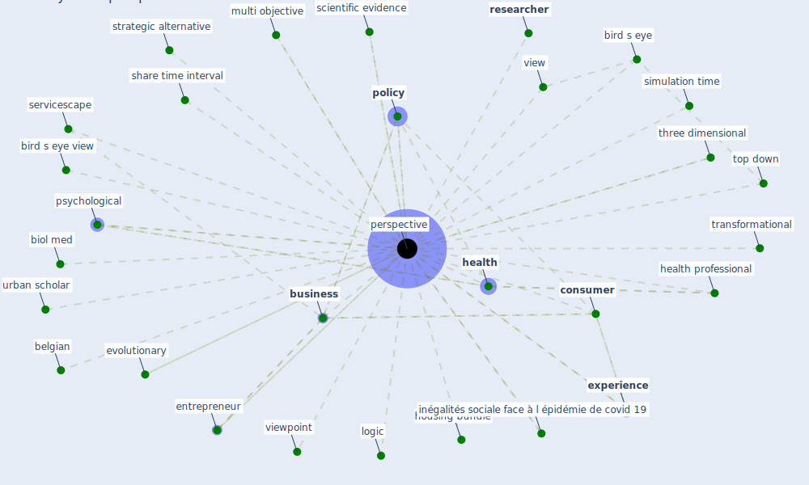

# Keyword: perspective

## Keywords

 * belgian, biol med, bird s eye, bird s eye view, [business](keyword_business), classification, [consumer](keyword_consumer), [entrepreneur](keyword_entrepreneur), evolutionary, evolutionary perspective, [experience](keyword_experience), gender, gender based perspective, [health](keyword_health), health professional, health psychology, housing bundle, housing study, interdisciplinary, [inégalités sociale face à l épidémie de covid 19](keyword_inégalités_sociale_face_à_l_épidémie_de_covid_19), logic, longitudinal, multi objective, multi objective perspective, multisensory, new metropolitan, outside in view, [perspective](keyword_perspective), perspective document, perspectives, [policy](keyword_policy), [practice](keyword_practice), [psychological](keyword_psychological), quantitative, reanalyse, [researcher](keyword_researcher), roi, scientific evidence, servicescape, share time interval, [simulation](keyword_simulation), simulation time, strategic alternative, three dimensional, time interval, top down, top down view, tourism management, transformational, urban scholar, view, viewpoint

## Mapping

## Neighbours

### Closest articles

* Mobility Behaviour in View of the Impact of the COVID-19 Pandemic—Public Transport Users in Gdansk Case Study - [LINK](article_przybylowski_mobility_2021)
* The COVID-19 pandemic: Impacts on cities and major lessons for urban planning, design, and management - [LINK](article_sharifi_covid-19_2020)
* How COVID-19 Could Accelerate the Adoption of New Retail Technologies and Enhance the (E-)Servicescape - [LINK](article_willems_how_2021)
* Towards the sustainable development of smart cities through mass video surveillance: A response to the COVID-19 pandemic - [LINK](article_shorfuzzaman_towards_2021)
* Designing a Multi-Agent Occupant Simulation System to Support Facility Planning and Analysis for COVID-19 - [LINK](article_lee_designing_2021)
* Revisiting the built environment: 10 potential development changes and paradigm shifts due to COVID-19 - [LINK](article_cheshmehzangi_revisiting_2021)
* Prototype Early Warning Systems for Vector-Borne Diseases in Europe - [LINK](article_semenza_prototype_2015)
* A Review on Building Design as a Biomedical System for Preventing COVID-19 Pandemic - [LINK](article_amran_review_2022)
* The Emergence of Anti-Privacy and Control at the Nexus between the Concepts of Safe City and Smart City - [LINK](article_allam_emergence_2019)
* Green infrastructure through the lens of “One Health”: A systematic review and integrative framework uncovering synergies and trade-offs between mental health and wildlife support in cities - [LINK](article_felappi_green_2020)

### Closest BPs

