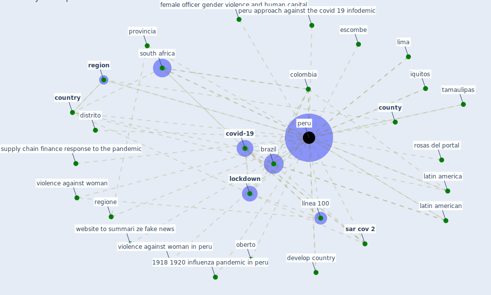

# Keyword: peru

## Keywords

 * 1918 1920 influenza pandemic in peru, a website to summari ze fake news, agüero, [brazil](keyword_brazil), colombia, [country](keyword_country), [county](keyword_county), [covid-19](keyword_covid-19), develop country, dhs, distrito, epicentre, escombe, female officer gender violence and human capital, female officer gender violenceand human capital, high level of intimate partner violence, implement, intimate partner violence, iquitos, latin america, latin american, latina america, lima, [lockdown](keyword_lockdown), línea, línea 100, ministerio de la, oberto, [pandemic](keyword_pandemic), [peru](keyword_peru), peru approach against the covid 19 infodemic, provincia, [region](keyword_region), regione, rosas del portal, [sar cov 2](keyword_sar_cov_2), [south africa](keyword_south_africa), supply chain finance response to the pandemic, tamaulipas, violence against woman, violence against woman in peru, website to summari ze fake news, wilson hernández breña

## Mapping

## Neighbours

### Closest articles

* COVID-19 and the rise of intimate partner violence - [LINK](article_aguero_covid-19_2021)
* Upper-Room Ultraviolet Light and Negative Air Ionization to Prevent Tuberculosis Transmission - [LINK](article_escombe_upper-room_2009)
* How COVID-19 Could Accelerate the Adoption of New Retail Technologies and Enhance the (E-)Servicescape - [LINK](article_willems_how_2021)
* Respiratory pandemics, urban planning and design: A multidisciplinary rapid review of the literature - [LINK](article_harris_respiratory_2022)
* The changes in the effects of social media use of Cypriots due to COVID-19 pandemic - [LINK](article_kaya_changes_2020)
* Air Disinfection for Airborne Infection Control with a Focus on COVID‐19: Why Germicidal UV is Essential             † - [LINK](article_nardell_air_2021)
* The ventilation of buildings and other mitigating measures for COVID-19: a focus on wintertime - [LINK](article_burridge_ventilation_2021)
* A comprehensive review on indoor air quality monitoring systems for enhanced public health - [LINK](article_saini_comprehensive_2020)
* Global value chains: Efficiency and risks in the context of COVID-19 - [LINK](article_oecd_global_2021)
* Nurture to nature via COVID-19, a self-regenerating environmental strategy of environment in global context - [LINK](article_paital_nurture_2020)

### Closest BPs

