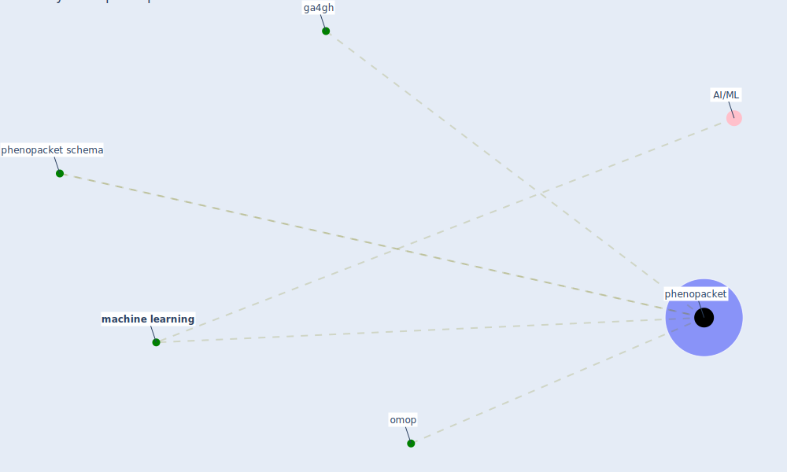

# Keyword: phenopacket

## Keywords

 * ga4gh, [machine learning](keyword_machine_learning), omop, [phenopacket](keyword_phenopacket), phenopacket schema, phenopackets

## Mapping

## Neighbours

### Closest articles

* The COVID-19 epidemiology and monitoring ontology - [LINK](article_queralt-rosinach_covid-19_2021)

### Closest BPs

