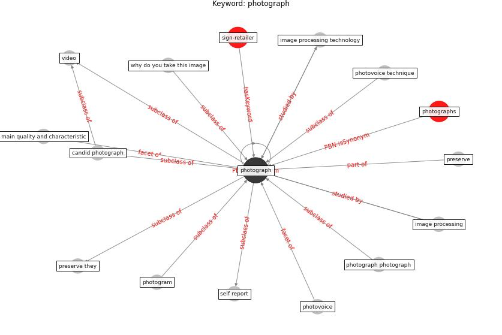

# Keyword: photograph

* [sign-retailer](cluster_Cluster_8)

## Keywords

 * Cluster_8, candid photograph, image processing, image processing technology, main quality and characteristic, photogram, [photograph](keyword_photograph), photograph photograph, photographs, photovoice, photovoice technique, preserve, preserve they, self report, video, why do you take this image

## Concepts

 

## Neighbours

### Closest articles

* A Mixed Approach on Resilience of Spanish Dwellings and Households during COVID-19 Lockdown - [LINK](article_cuerdo-vilches_mixed_2020)
* How COVID-19 Could Accelerate the Adoption of New Retail Technologies and Enhance the (E-)Servicescape - [LINK](article_willems_how_2021)
* Retail Signage During the COVID-19 Pandemic - [LINK](article_mcneish_retail_2020)
* The impact of climate change on the epidemiology and control of Rift Valley fever - PubMed - [LINK](article_martin_impact_2008)

### Closest BPs

