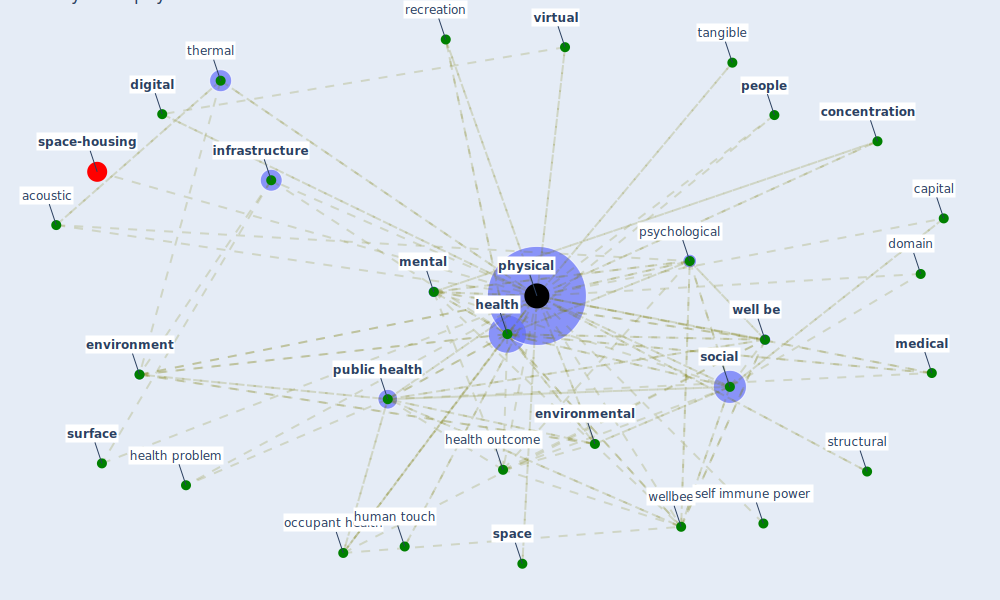

# Keyword: physical

* [space-housing](cluster_4)

## Keywords

 * Cluster_4, acoustic, barrier, [build environment](keyword_build_environment), build health, capital, chemical, cognitive, complaint, [concentration](keyword_concentration), [contact](keyword_contact), [cost](keyword_cost), [digital](keyword_digital), [domain](keyword_domain), domestic violence, [environment](keyword_environment), [environmental](keyword_environmental), exercise, fitness, [green space](keyword_green_space), [health](keyword_health), health outcome, health problem, health relate quality of life, human touch, [infrastructure](keyword_infrastructure), [interaction](keyword_interaction), intimate partner violence, intimatepartner violence, legislative limitation, [logistic](keyword_logistic), [medical](keyword_medical), [mental](keyword_mental), metaphorical, morphological, [nature](keyword_nature), nebulization, [occupant health](keyword_occupant_health), [office](keyword_office), [people](keyword_people), [physical](keyword_physical), practical, pre ence, protection, [psychological](keyword_psychological), [public health](keyword_public_health), recreation, [resilience](keyword_resilience), retail, self immune power, sensory, [social](keyword_social), [space](keyword_space), structural, [surface](keyword_surface), surface contact, system status, tangible, thermal, [ultraviolet](keyword_ultraviolet), violence, [virtual](keyword_virtual), [well be](keyword_well_be), [wellbee](keyword_wellbee)

## Mapping

## Neighbours

### Closest articles

* Occupant health in buildings: Impact of the COVID-19 pandemic on the opinions of building professionals and implications on research - [LINK](article_awada_occupant_2022)
* Ten questions concerning occupant health in buildings during normal operations and extreme events including the COVID-19 pandemic - [LINK](article_awada_ten_2021)
* How COVID-19 Could Accelerate the Adoption of New Retail Technologies and Enhance the (E-)Servicescape - [LINK](article_willems_how_2021)
* The impact of the COVID-19 pandemic on the importance of urban green spaces to the public - [LINK](article_noszczyk_impact_2022)
* Towards Resilient Residential Buildings and Neighborhoods in Light of COVID-19 Pandemic—The Scenario of Podgorica, Montenegro - [LINK](article_bojovic_towards_2022)
* Urban Community Sustainable Development Patterns under the Influence of COVID-19: A Case Study Based on the Non-Contact Interaction Perspective of Hangzhou City - [LINK](article_wang_urban_2021)
* Biophilic design in architecture and its contributions to health, well-being, and sustainability: A critical review - [LINK](article_zhong_biophilic_2022)
* Designing Post COVID-19 Buildings: Approaches for Achieving Healthy Buildings - [LINK](article_navaratnam_designing_2022)
* Health, Wellbeing \& Productivity in Offices - [LINK](article_world_green_building_council_health_2014)
* Prophylactic Architecture: Formulating the Concept of Pandemic-Resilient Homes - [LINK](article_elrayies_prophylactic_2022)

### Closest BPs

