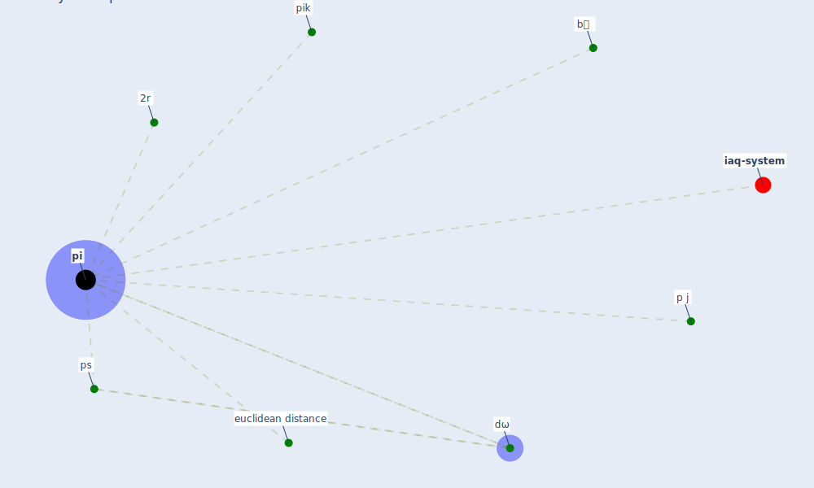

# Keyword: pi

* [iaq-system](cluster_3)

## Keywords

 * 2r, Cluster_3, b裸, dω, euclidean distance, p j, [pi](keyword_pi), pik, ps

## Mapping

## Neighbours

### Closest articles

* Understanding the role of urban design in disease spreading - [LINK](article_brizuela_understanding_2019)
* The efficacy of social distance and ventilation effectiveness in preventing COVID-19 transmission - [LINK](article_sun_efficacy_2020)
* Social distancing enhanced automated optimal design of physical spaces in the wake of the COVID-19 pandemic - [LINK](article_ugail_social_2021)
* DeepSOCIAL: Social Distancing Monitoring and Infection Risk Assessment in COVID-19 Pandemic - [LINK](article_rezaei_deepsocial_2020)

### Closest BPs

