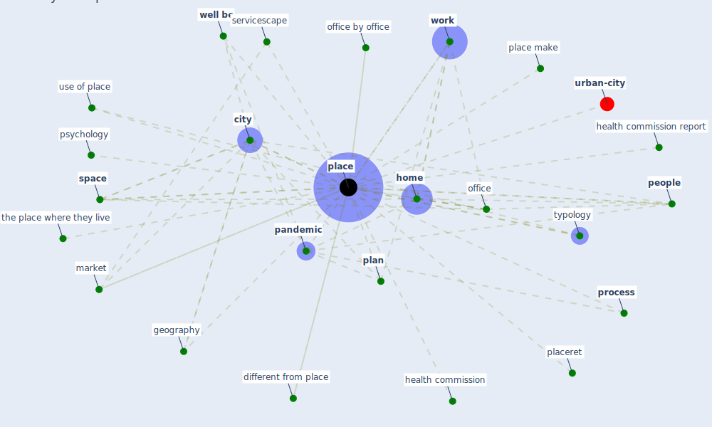

# Keyword: place

* [urban-city](cluster_6)

## Keywords

 * Cluster_6, [city](keyword_city), different from place, geography, health commission, health commission report, [home](keyword_home), market, [office](keyword_office), office by office, [pandemic](keyword_pandemic), [people](keyword_people), [place](keyword_place), place make, placed, placeret, places, [plan](keyword_plan), [process](keyword_process), psychology, servicescape, [space](keyword_space), the place where they live, typology, use of place, [well be](keyword_well_be), [work](keyword_work)

## Mapping

## Neighbours

### Closest articles

* Health, Wellbeing \& Productivity in Offices - [LINK](article_world_green_building_council_health_2014)
* Coronavirus questions that will not go away: interrogating urban and socio-spatial implications of COVID-19 measures - [LINK](article_salama_coronavirus_2020)
* Urban Community Sustainable Development Patterns under the Influence of COVID-19: A Case Study Based on the Non-Contact Interaction Perspective of Hangzhou City - [LINK](article_wang_urban_2021)
* Houses amid COVID-19: Environmental challenges and design adaptation - [LINK](article_hizra_houses_2021)
* Strengthening resilience: a priority shared by Health 2020 and - [LINK](article_who_strengthening_2017)
* How the Coronavirus Will Reshape Architecture - [LINK](article_chayka_how_2020)
* Impact of Covid-19 on the built environment - [LINK](article_mahima_impact_2022)
* Respiratory pandemics, urban planning and design: A multidisciplinary rapid review of the literature - [LINK](article_harris_respiratory_2022)
* Green infrastructure through the lens of “One Health”: A systematic review and integrative framework uncovering synergies and trade-offs between mental health and wildlife support in cities - [LINK](article_felappi_green_2020)
* Revisiting the built environment: 10 potential development changes and paradigm shifts due to COVID-19 - [LINK](article_cheshmehzangi_revisiting_2021)

### Closest BPs

