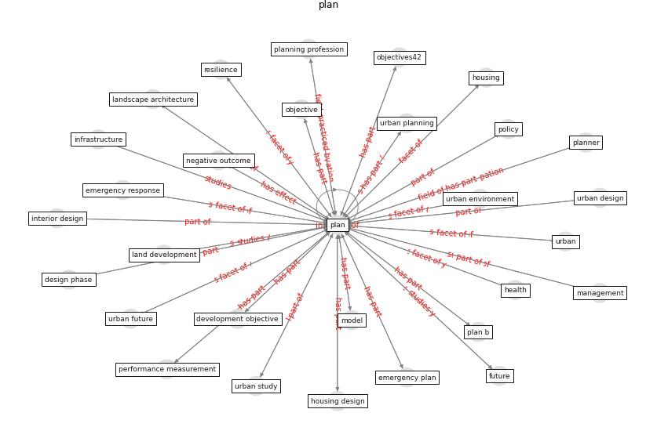

# Keyword: __plan__
## Clusters

* Cluster 7: [tourism-tourist](cluster_7)

## Concepts

 

## Top 10 articles for __plan__
* rtpi_urban_2021 ([rtpi_urban_2021](article_rtpi_urban_2021))
* The COVID-19 pandemic: Impacts on cities and major
lessons for urban planning, design, and management ([sharifi_covid-19_2020](article_sharifi_covid-19_2020))
* afrin_covid-19_2021 ([afrin_covid-19_2021](article_afrin_covid-19_2021))
* Contributions of Smart City Solutions and
Technologies to Resilience against the COVID-19
Pandemic: A Literature Review ([sharifi_contributions_2021](article_sharifi_contributions_2021))
* realdania_refleksioner_2022_EN ([realdania_refleksioner_2022_EN](article_realdania_refleksioner_2022_EN))
* Towards Resilient Residential Buildings and
Neighborhoods in Light of COVID-19 Pandemic—The
Scenario of Podgorica, Montenegro ([bojovic_towards_2022](article_bojovic_towards_2022))
* Effects of the COVID-19 pandemic on the use and
perceptions of urban green space: An international
exploratory study ([ugolini_effects_2020](article_ugolini_effects_2020))
* Housing Experience in Gated Communities in the
Time of Pandemics: Lessons Learned from
COVID-19 ([asfour_housing_2022](article_asfour_housing_2022))
* COVID-19 and Green Housing: A Review of
Relevant Literature ([kaklauskas_covid-19_2021](article_kaklauskas_covid-19_2021))
* The Impact of COVID-19 on Public Space: A
Review of the Emerging Questions ([honey-roses_impact_2020](article_honey-roses_impact_2020))
