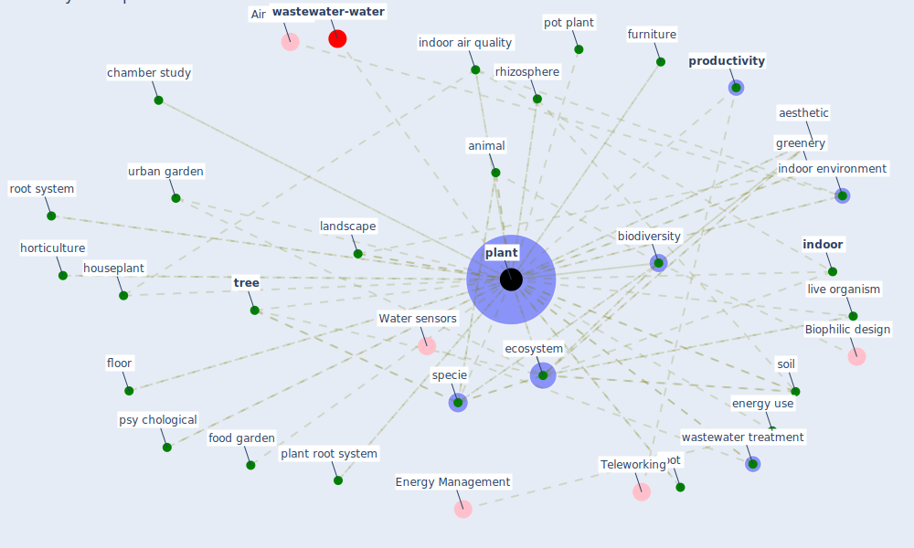

# Keyword: plant

* [wastewater-water](cluster_0)

## Keywords

 * Cluster_0, aesthetic, air cleaning plant, animal, [biodiversity](keyword_biodiversity), chamber study, cold indoor plant, [ecosystem](keyword_ecosystem), energy use, food garden, furniture, greenery, greenhouse, grow medium, [home](keyword_home), horticulture, houseplant, [indoor](keyword_indoor), indoor air pollution, [indoor air quality](keyword_indoor_air_quality), [indoor environment](keyword_indoor_environment), ivy, landscape, leaf stoma, leave, live organism, machinery, [nature](keyword_nature), [plant](keyword_plant), plant community diversity, plant medicine, plant root system, plants, pot, pot plant, productiviteit, [productivity](keyword_productivity), psy chological, rhizosphere, root, root bed, root system, root zone, shrub, soil, specie, substrate, [treatment](keyword_treatment), [tree](keyword_tree), urban garden, [vocs](keyword_vocs), wall, wastewater treatment, floor

## Mapping

## Neighbours

### Closest articles

* Characterization and performance evaluation of a full-scale activated carbon-based dynamic botanical air filtration system for improving indoor air quality - [LINK](article_wang_characterization_2011)
* Biophilic design in architecture and its contributions to health, well-being, and sustainability: A critical review - [LINK](article_zhong_biophilic_2022)
* Designing Post COVID-19 Buildings: Approaches for Achieving Healthy Buildings - [LINK](article_navaratnam_designing_2022)
* Green infrastructure through the lens of “One Health”: A systematic review and integrative framework uncovering synergies and trade-offs between mental health and wildlife support in cities - [LINK](article_felappi_green_2020)
* Prophylactic Architecture: Formulating the Concept of Pandemic-Resilient Homes - [LINK](article_elrayies_prophylactic_2022)
* Association between indoor-outdoor green features and psychological health during the COVID-19 lockdown in Italy: A cross-sectional nationwide study - [LINK](article_spano_association_2021)
* Responsible Transport: A post-COVID agenda for transport policy and practice - [LINK](article_budd_responsible_2020)
* Health, Wellbeing \& Productivity in Offices - [LINK](article_world_green_building_council_health_2014)
* Coronavirus and Climate Change - [LINK](article_harvard_th_chan_schoold_of_public_health_coronavirus_2020)
* Assessment method for new sustainability indicators providing pandemic resilience for residential buildings - [LINK](article_tokazhanov_assessment_2021)

### Closest BPs

