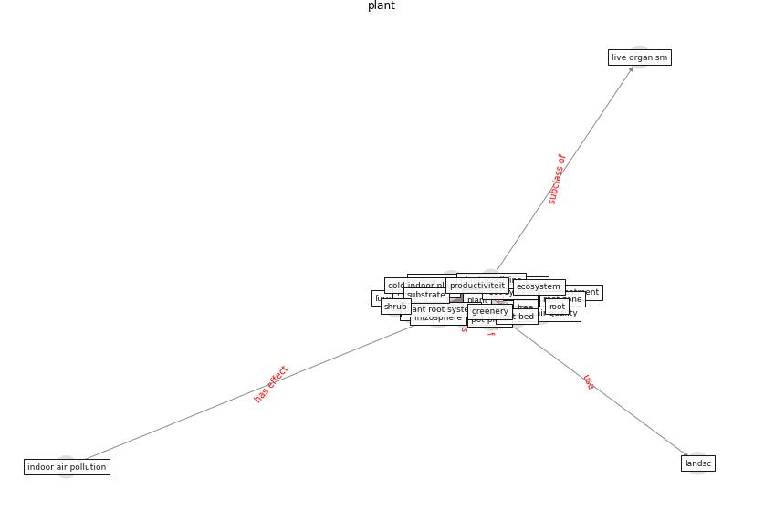

# Keyword: __plant__
## Clusters

* Cluster 4: [air-formaldehyde](cluster_4)

## Concepts

 

## Articles
* Characterization and performance evaluation of a
full-scale activated carbon-based dynamic botanical air
filtration system for improving indoor air quality ([wang_characterization_2011](article_wang_characterization_2011))
* Biophilic design in architecture and its contributions to
health, well-being, and sustainability: A critical
review ([zhong_biophilic_2022](article_zhong_biophilic_2022))
* Designing Post COVID-19 Buildings: Approaches for
Achieving Healthy Buildings ([navaratnam_designing_2022](article_navaratnam_designing_2022))
* Prophylactic Architecture: Formulating the Concept
of Pandemic-Resilient Homes ([elrayies_prophylactic_2022](article_elrayies_prophylactic_2022))
* Biophilic design in architecture and its contributions to
health, well-being, and sustainability: A critical
review ([zhong_biophilic_2022](article_zhong_biophilic_2022))
* harvard_th_chan_schoold_of_public_health_coronavirus_2020 ([harvard_th_chan_schoold_of_public_health_coronavirus_2020](article_harvard_th_chan_schoold_of_public_health_coronavirus_2020))
* harvard_chan_community_coronavirus_2020 ([harvard_chan_community_coronavirus_2020](article_harvard_chan_community_coronavirus_2020))
* Assessment method for new sustainability indicators
providing pandemic resilience for residential buildings ([tokazhanov_assessment_2021](article_tokazhanov_assessment_2021))
* world_green_building_council_health_2014-700 ([world_green_building_council_health_2014-700](article_world_green_building_council_health_2014-700))
* world_green_building_council_health_2014-650 ([world_green_building_council_health_2014-650](article_world_green_building_council_health_2014-650))
