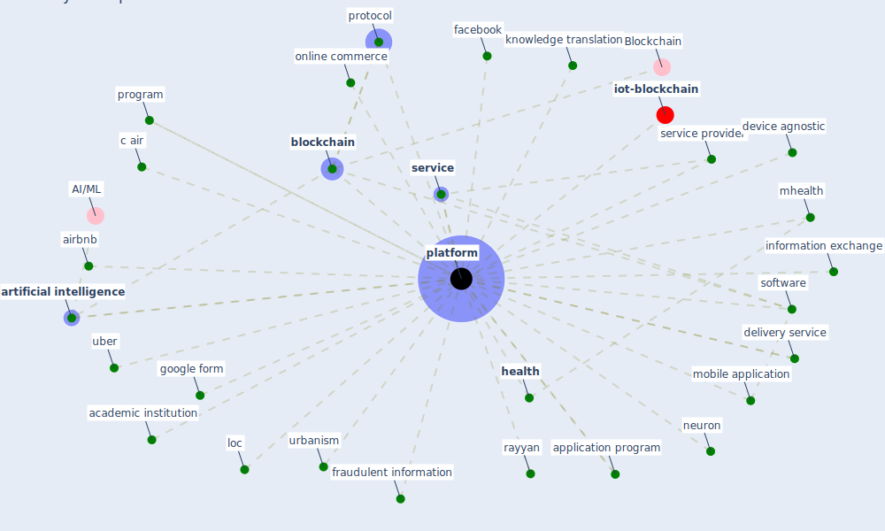

# Keyword: platform

* [iot-blockchain](cluster_7)

## Keywords

 * Cluster_7, academic institution, airbnb, application program, [artificial intelligence](keyword_artificial_intelligence), [blockchain](keyword_blockchain), c air, cart, cognitive computing, cross platform, [datum](keyword_datum), [delivery](keyword_delivery), delivery service, device agnostic, device platform, [digital](keyword_digital), [facebook](keyword_facebook), fraudulent information, google form, [health](keyword_health), information exchange, knowledge translation, loc, mhealth, mobile application, neuron, online commerce, [platform](keyword_platform), platforms, program, [protocol](keyword_protocol), rayyan, [service](keyword_service), service provider, software, uber, [urbanism](keyword_urbanism), weibo

## Mapping

## Neighbours

### Closest articles

* World Bank Development Report - [LINK](article_world_bank_world_2022)
* Scalable IoT Architecture for Monitoring IEQ Conditions in Public and Private Buildings - [LINK](article_calvo_scalable_2022)
* Blockchain technology and its applications to combat COVID-19 pandemic - [LINK](article_sharma_blockchain_2022)
* A Comprehensive Review of the COVID-19 Pandemic and the Role of IoT, Drones, AI, Blockchain, and 5G in Managing its Impact - [LINK](article_chamola_comprehensive_2020)
* Continuous IEQ monitoring system: Context and development - [LINK](article_parkinson_continuous_2019)
* The three modes of existence of the pandemic smart city - [LINK](article_soderstrom_three_2021)
* Smart cities and the pandemic: digital technologies on the urban management of Brazilian cities - [LINK](article_fariniuk_smart_2020)
* Amplifying the role of knowledge translation platforms in the COVID-19 pandemic response - [LINK](article_el-jardali_amplifying_2020)
* Mobile Technology Solution for COVID-19: Surveillance and Prevention - [LINK](article_raza_mobile_2021)
* What has been the impact of the COVID-19 pandemic on immigrants? An update on recent evidence - [LINK](article_oecd_what_2022)

### Closest BPs

