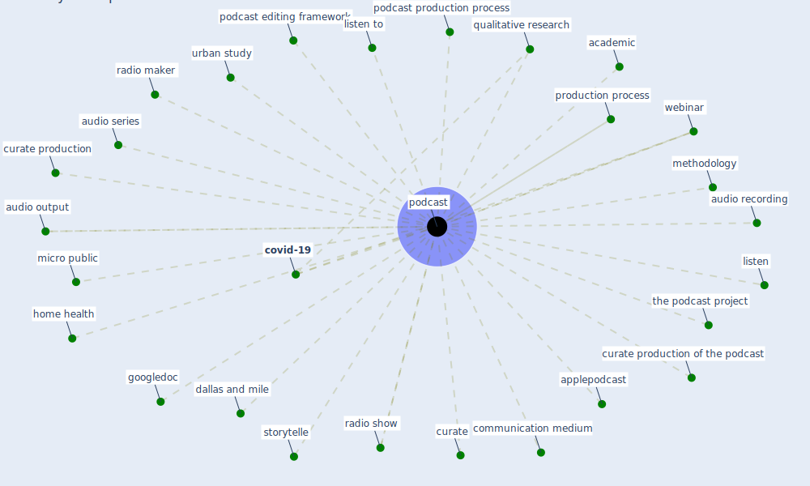

# Keyword: podcast

## Keywords

 * academic, applepodcast, audio output, audio recording, audio series, communication medium, [covid-19](keyword_covid-19), curate, curate production, curate production of the podcast, dallas and mile, googledoc, home health, listen, listen to, methodology, micro public, [podcast](keyword_podcast), podcast editing framework, podcast production process, podcasting, podcasts, production process, qualitative research, radio maker, radio show, storytelle, the podcast project, urban study, webinar

## Mapping

## Neighbours

### Closest articles

* The City Under COVID‐19: Podcasting As Digital Methodology - [LINK](article_rogers_city_2020)
* Assessment method for new sustainability indicators providing pandemic resilience for residential buildings - [LINK](article_tokazhanov_assessment_2021)
* Revisiting the built environment: 10 potential development changes and paradigm shifts due to COVID-19 - [LINK](article_cheshmehzangi_revisiting_2021)
* Amplifying the role of knowledge translation platforms in the COVID-19 pandemic response - [LINK](article_el-jardali_amplifying_2020)
* How COVID-19 Could Accelerate the Adoption of New Retail Technologies and Enhance the (E-)Servicescape - [LINK](article_willems_how_2021)

### Closest BPs

