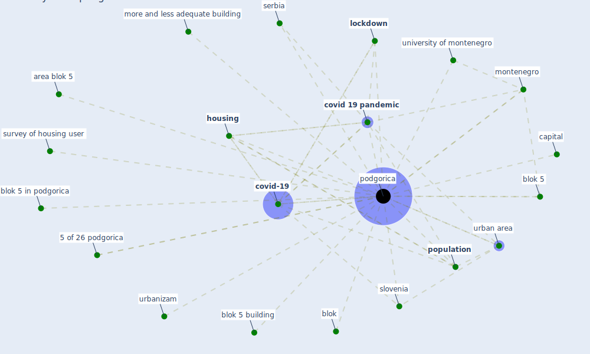

# Keyword: podgorica

## Keywords

 * 5 of 26 podgorica, area blok 5, blok, blok 5, blok 5 building, blok 5 in podgorica, capital, [covid 19 pandemic](keyword_covid_19_pandemic), [covid-19](keyword_covid-19), [housing](keyword_housing), [lockdown](keyword_lockdown), [montenegro](keyword_montenegro), more and less adequate building, [podgorica](keyword_podgorica), [population](keyword_population), serbia, [slovenia](keyword_slovenia), survey of housing user, university of montenegro, urban area, urbanizam

## Mapping

## Neighbours

### Closest articles

* Towards Resilient Residential Buildings and Neighborhoods in Light of COVID-19 Pandemic—The Scenario of Podgorica, Montenegro - [LINK](article_bojovic_towards_2022)
* Prophylactic Architecture: Formulating the Concept of Pandemic-Resilient Homes - [LINK](article_elrayies_prophylactic_2022)

### Closest BPs

