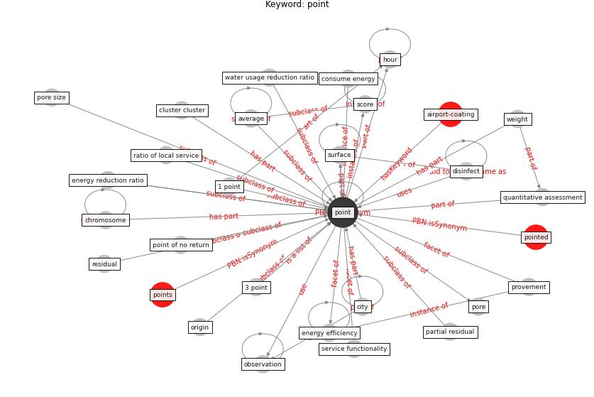

# Keyword: point

* [airport-coating](cluster_Cluster_6)

## Keywords

 * 1 point, 3 point, Cluster_6, average, chromosome, [city](keyword_city), cluster cluster, consume energy, disinfect, [energy efficiency](keyword_energy_efficiency), energy reduction ratio, hour, observation, origin, partial residual, [point](keyword_point), point of no return, pointed, points, pore, pore size, provement, quantitative assessment, ratio of local service, residual, score, service functionality, [surface](keyword_surface), water usage reduction ratio, weight

## Concepts

 

## Neighbours

### Closest articles

* Assessment method for new sustainability indicators providing pandemic resilience for residential buildings - [LINK](article_tokazhanov_assessment_2021)
* Green spaces, especially forest, linked to lower SARS-CoV-2 infection rates: A one-year nationwide study - [LINK](article_jiang_green_2021)
* Assessment of Building Automation and Control Systems in Danish Healthcare Facilities in the COVID-19 Era - [LINK](article_pedersen_assessment_2022)
* Influence between COVID-19 Impacts and Project Stakeholders in Chilean Construction Projects - [LINK](article_araya_influence_2021)
* Readiness Assessment of Green Building Certification Systems for Residential Buildings during Pandemics - [LINK](article_tleuken_readiness_2021)
* How COVID-19 Could Accelerate the Adoption of New Retail Technologies and Enhance the (E-)Servicescape - [LINK](article_willems_how_2021)
* A Surface Coating that Rapidly Inactivates SARS-CoV-2 - [LINK](article_behzadinasab_surface_2020)
* The effect of occupant distribution on energy consumption and COVID-19 infection in buildings: A case study of university building - [LINK](article_mokhtari_effect_2021)
* Refleksioner fra en pandemi - [LINK](article_realdania_refleksioner_2022)

### Closest BPs

