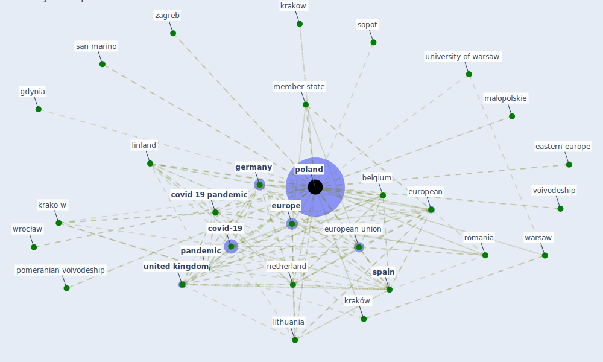

# Keyword: poland

## Keywords

 * almp, baltic sea, belgium, care allowance, case study, case study of poland, cee country, child s club, civil law, contract of limited duration, council of minister poland 2013, covid 19 epidemic, covid 19 epidemic in poland, [covid 19 pandemic](keyword_covid_19_pandemic), covid 19related, covid 19related home confinement, [covid-19](keyword_covid-19), covid19 case and death in poland, credit bureau, eastern europe, education system, eu member state, [europe](keyword_europe), european, [european union](keyword_european_union), [finland](keyword_finland), gdan sk, gdansk, gdynia, [germany](keyword_germany), grant, greece, kapecki, kielce, kowalski, [krako w](keyword_krako_w), krakow, krakow wieliczka, krakowskie przedmieście, kraków, kraków airport, labour inspectorate, large urban zone, lithuania, maluch, maluch 2015, maluch programme, małopolskie, [member state](keyword_member_state), miniatura 3, minister of health, most striking example, [netherland](keyword_netherland), npl, npl level, outbreak of the pandemic, [pandemic](keyword_pandemic), pol, [poland](keyword_poland), polycentricity, pomeranian voivodeship, pre retirement protection of old worker, restriction relate to public transport, romania, san marino, senior wigor, similar regulation, solidarity of generation, sopot, [spain](keyword_spain), szymkowski, [taiwan](keyword_taiwan), temporary employment act, thailand, the experience, the most striking example, the pandemic, the virus, training fund, [united kingdom](keyword_united_kingdom), university of agriculture in krakow, university of gdansk, university of jan kochanowski, university of warsaw, voivodeship, voluntary labour corps, war study, war study university, warsaw, warsaw bank and credit 12, wieliczka, worker can set the hour, worker can set the hour for start their workday, wroclaw, wrocław, wsj, wsj in, young people in poland, zagreb, zrównoważony

## Mapping

## Neighbours

### Closest articles

* Sustainable work throughout the life course: National policies and strategies, Publications Office of the European Union - [LINK](article_eurofund_sustainable_2016)
* The impact of the COVID-19 pandemic on the importance of urban green spaces to the public - [LINK](article_noszczyk_impact_2022)
* How COVID-19 Could Accelerate the Adoption of New Retail Technologies and Enhance the (E-)Servicescape - [LINK](article_willems_how_2021)
* 2020 Data Protection Report - [LINK](article_council_of_europe_2020_2020)
* World Bank Development Report - [LINK](article_world_bank_world_2022)
* COVID19-Routes: A Safe Pedestrian Navigation Service - [LINK](article_cantarero_covid19-routes_2021)
* What has been the impact of the COVID-19 pandemic on immigrants? An update on recent evidence - [LINK](article_oecd_what_2022)
* Mobility Behaviour in View of the Impact of the COVID-19 Pandemic—Public Transport Users in Gdansk Case Study - [LINK](article_przybylowski_mobility_2021)
* A Global Survey of Infection Control and Mitigation Measures for Combating the Transmission of COVID-19 Pandemic in Buildings Under Facilities Management Services - [LINK](article_sarvari_global_2022)
* A Mixed Approach on Resilience of Spanish Dwellings and Households during COVID-19 Lockdown - [LINK](article_cuerdo-vilches_mixed_2020)

### Closest BPs

