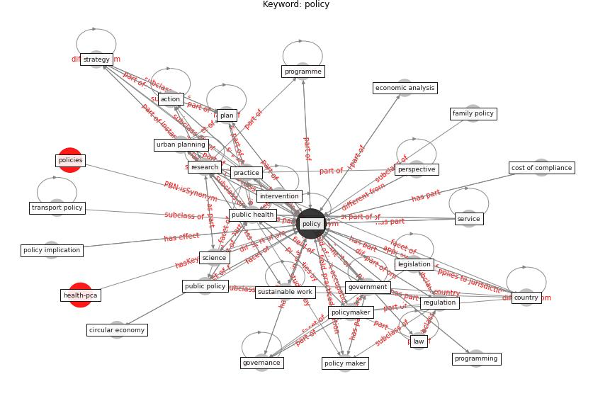

# Keyword: policy

* [health-pca](cluster_Cluster_9)

## Keywords

 * action, ad hoc, adaptation, approach, aspect of policy, behavior, brief, [circular economy](keyword_circular_economy), citizen engagement, coherent framework, competition policy, [conservation](keyword_conservation), coordination, cost of compliance, [country](keyword_country), country study, debt moratoria, design decision, dynamic, economic analysis, family policy, financial instrument, governance, [government](keyword_government), [health](keyword_health), health equity, health policy, health policy plan, housing and domestic abuse, housing policy, [impact](keyword_impact), implementation, [inequality](keyword_inequality), intervention, intervention design, [knowledge](keyword_knowledge), [labour market](keyword_labour_market), labour market inclusion, land use policy, [law](keyword_law), legal, legislation, limit immigration, long term, management, [measure](keyword_measure), [mitigation](keyword_mitigation), national, [organisation](keyword_organisation), part a, [perspective](keyword_perspective), [plan](keyword_plan), [policy](keyword_policy), policy analysis, policy implication, policy level, policy maker, policy making, policy recommendation, policymaker, politic, practice, [privacy](keyword_privacy), [privacy policy](keyword_privacy_policy), procedure, programme, programming, prospect, protectionism, [protocol](keyword_protocol), [public](keyword_public), [public health](keyword_public_health), public health crisis, public health research, public intervention, public policy, public work management, recommendation, reform, regulation, regulatory, regulatory fixmeframework, [research](keyword_research), research part, science, [sector](keyword_sector), sectoral, service, [social](keyword_social), social distancing policy, sovereign debt, strategy, [sustainable](keyword_sustainable), [sustainable development](keyword_sustainable_development), [sustainable work](keyword_sustainable_work), transition, [transport](keyword_transport), [transport policy](keyword_transport_policy), [urban planning](keyword_urban_planning), urban policy

## Concepts

 

## Neighbours

### Closest articles

* Sustainable work throughout the life course: National policies and strategies, Publications Office of the European Union - [LINK](article_eurofund_sustainable_2016)
* World Bank Development Report - [LINK](article_world_bank_world_2022)
* Addressing vulnerability, building resilience: community-based adaptation to vector-borne diseases in the context of global change - [LINK](article_bardosh_addressing_2017)
* Guidelines for resilience systems analysis - [LINK](article_oecd_guidelines_2014)
* Urban planning after COVID-19 - [LINK](article_rtpi_urban_2021)
* Amplifying the role of knowledge translation platforms in the COVID-19 pandemic response - [LINK](article_el-jardali_amplifying_2020)
* COVID-19 and regional solutions for mitigating the risk of SME finance in selected ASEAN member states - [LINK](article_taghizadeh-hesary_covid-19_2022)
* Mitigation strategies and compliance in the COVID-19 fight; how much compliance is enough? - [LINK](article_mukerjee_mitigation_2021)
* How COVID-19 Could Accelerate the Adoption of New Retail Technologies and Enhance the (E-)Servicescape - [LINK](article_willems_how_2021)
* Revisiting the built environment: 10 potential development changes and paradigm shifts due to COVID-19 - [LINK](article_cheshmehzangi_revisiting_2021)

### Closest BPs

