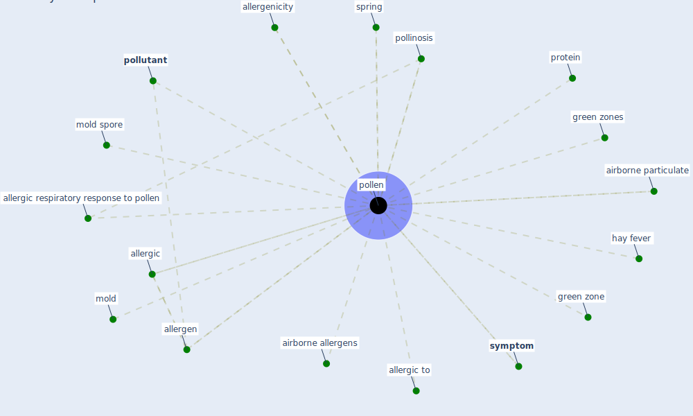

# Keyword: pollen

## Keywords

 * airborne allergens, airborne particulate, allergen, allergenicity, allergic, allergic respiratory response to pollen, allergic to, green zone, green zones, hay fever, mold, mold spore, [pollen](keyword_pollen), pollinosis, [pollutant](keyword_pollutant), protein, spring, [symptom](keyword_symptom)

## Mapping

## Neighbours

### Closest articles

* Making green infrastructure healthier infrastructure - [LINK](article_lohmus_making_2015)
* An environmental and health perspective for COVID-19 outbreak: Meteorology and air quality influence, sewage epidemiology indicator, hospitals disinfection, drug therapies and recommendations - [LINK](article_barcelo_environmental_2020)
* Air Disinfection for Airborne Infection Control with a Focus on COVID‐19: Why Germicidal UV is Essential             † - [LINK](article_nardell_air_2021)
* A critical review of heating, ventilation, and air conditioning (HVAC) systems within the context of a global SARS-CoV-2 epidemic - [LINK](article_elsaid_critical_2021)
* Challenges to Mitigating the Urban Health Burden of Mosquito-Borne Diseases in the Face of Climate Change - [LINK](article_ligsay_challenges_2021)
* ASHRAE Position Document on Infectious Aerosols - [LINK](article_ashrae_ashrae_2022)

### Closest BPs

