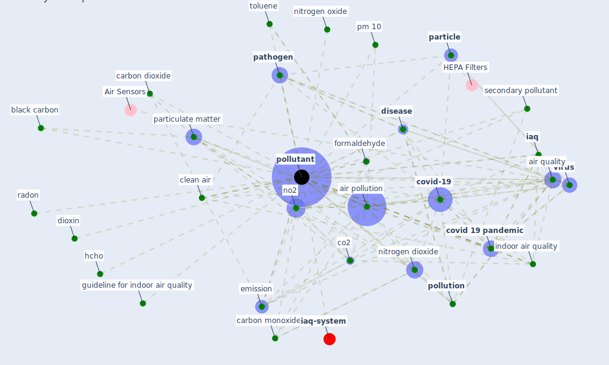

# Keyword: pollutant

* [iaq-system](cluster_3)

## Keywords

 * Cluster_3, [aerosol](keyword_aerosol), [air](keyword_air), air cleaning, air conditioner, [air pollutant](keyword_air_pollutant), [air pollution](keyword_air_pollution), air purification, air quality, airborne chemical, allergen, ambient air quality index, ammonia, bed water, benzene, biological, black carbon, [build](keyword_build), [building](keyword_building), building material, carbon dioxide, carbon monoxide, chemical, clean air, co2, co2 emission, collide, concentration in chamber, contaminant, [covid 19 pandemic](keyword_covid_19_pandemic), [covid-19](keyword_covid-19), dioxin, [disease](keyword_disease), [ecosystem](keyword_ecosystem), emission, emit, [environment](keyword_environment), [exposure](keyword_exposure), fine particulate matter, [formaldehyde](keyword_formaldehyde), gaseous pollutant, guideline for indoor air quality, hcho, [health](keyword_health), health relate consequence of exposure, heavy metal, high vwc, [iaq](keyword_iaq), illumination, [indoor](keyword_indoor), indoor air, indoor air concentration, [indoor air quality](keyword_indoor_air_quality), [infectious](keyword_infectious), inhale, inhale air, low emit material, low vwc, mass, mi crobiological, micropollutant, nitrogen dioxide, nitrogen oxide, no2, no2 and co, non buoyant, nox emission, o3, [particle](keyword_particle), particle matter, particle pollutant, particulate, particulate matter, [pathogen](keyword_pathogen), pharmaceutical, pm 10, pm 2, pm 2 5, [pollen](keyword_pollen), [pollutant](keyword_pollutant), pollutants, pollutants subj complications, [pollution](keyword_pollution), pollution level, radon, remove ambient pollutant, secondary gaseous pollutant, secondary pollutant, secondary pollution, [sewage](keyword_sewage), smog, so2, sox emission, [toluene](keyword_toluene), trend, urban air pollution, [ventilation](keyword_ventilation), ventilation system, [virus](keyword_virus), water content

## Mapping

## Neighbours

### Closest articles

* A critical review of heating, ventilation, and air conditioning (HVAC) systems within the context of a global SARS-CoV-2 epidemic - [LINK](article_elsaid_critical_2021)
* Characterization and performance evaluation of a full-scale activated carbon-based dynamic botanical air filtration system for improving indoor air quality - [LINK](article_wang_characterization_2011)
* A comprehensive review on indoor air quality monitoring systems for enhanced public health - [LINK](article_saini_comprehensive_2020)
* COVID-19 Higher Mortality in Chinese Regions With Chronic Exposure to Lower Air Quality - [LINK](article_pansini_covid-19_2021)
* The COVID-19 pandemic: Impacts on cities and major lessons for urban planning, design, and management - [LINK](article_sharifi_covid-19_2020)
* Health, Wellbeing \& Productivity in Offices - [LINK](article_world_green_building_council_health_2014)
* The contribution of green buildings in the fight against COVID-19 - [LINK](article_world_green_building_council_contribution_2020)
* Occupant health in buildings: Impact of the COVID-19 pandemic on the opinions of building professionals and implications on research - [LINK](article_awada_occupant_2022)
* A critical analysis of the impacts of COVID-19 on the global economy and ecosystems and opportunities for circular economy strategies - [LINK](article_ibn-mohammed_critical_2021)
* An environmental and health perspective for COVID-19 outbreak: Meteorology and air quality influence, sewage epidemiology indicator, hospitals disinfection, drug therapies and recommendations - [LINK](article_barcelo_environmental_2020)

### Closest BPs

