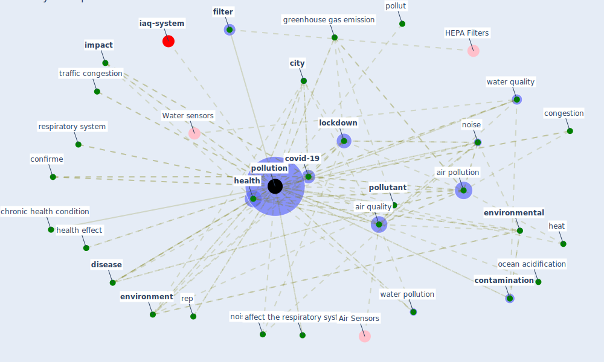

# Keyword: pollution

* [iaq-system](cluster_3)

## Keywords

 * affect the respiratory system, [air](keyword_air), air control, [air pollution](keyword_air_pollution), air purification, air quality, air quality control, air quality issue, airair pollution, [area](keyword_area), bacterium, beach, boat, carbon capture, carbon emission, chronic health condition, [city](keyword_city), [clean](keyword_clean), cleanliness, cleanse, congestion, containment measure, containment measure adopt over there, [contamination](keyword_contamination), contamination of the environment, confirme, [covid-19](keyword_covid-19), [disease](keyword_disease), dust, ecological, economic activity, energy cost, [energy efficiency](keyword_energy_efficiency), environ pollut, [environment](keyword_environment), [environmental](keyword_environmental), [exposure](keyword_exposure), externality, [filter](keyword_filter), [filtration](keyword_filtration), filtration system, fine particulate pollution, greenhouse gas emission, [health](keyword_health), health effect, health mitigation strategies, heat, high level of pollution, human activity, human dominancy, [human health](keyword_human_health), [impact](keyword_impact), impact of climate change, indoor air, indoor air pollutant, [lockdown](keyword_lockdown), low standard of living, marine protect area, minimally pollute, [mitigation](keyword_mitigation), nitrogen dioxide, [noise](keyword_noise), noise pollution, no₂ emission, ocean acidification, outdoor air, plant loading, pollut, [pollutant](keyword_pollutant), [pollution](keyword_pollution), pollution concentration, pollution prevention, poor air quality, population density, promiscuity, rapid obsolescence, reduce economic activity, rep, resource use, respiratory system, risk issue, secondary pollutant, [sewage](keyword_sewage), sick building syndrome, smoking, sodium hypochlorite disinfection, source of dust, the capacity of green roof, [theme](keyword_theme), toxicity, toxicity level, traffic congestion, traffic, unhygienic, urbanization, [vocs](keyword_vocs), [wastewater](keyword_wastewater), water pollution, water quality, welfare

## Mapping

## Neighbours

### Closest articles

* Nurture to nature via COVID-19, a self-regenerating environmental strategy of environment in global context - [LINK](article_paital_nurture_2020)
* The COVID-19 pandemic: Impacts on cities and major lessons for urban planning, design, and management - [LINK](article_sharifi_covid-19_2020)
* Urban planning after COVID-19 - [LINK](article_rtpi_urban_2021)
* A critical analysis of the impacts of COVID-19 on the global economy and ecosystems and opportunities for circular economy strategies - [LINK](article_ibn-mohammed_critical_2021)
* COVID-19 Higher Mortality in Chinese Regions With Chronic Exposure to Lower Air Quality - [LINK](article_pansini_covid-19_2021)
* A Review on Building Design as a Biomedical System for Preventing COVID-19 Pandemic - [LINK](article_amran_review_2022)
* The Role of Architecture and Urbanism in Preventing Pandemics - [LINK](article_kumar_role_2021)
* Coronavirus and Climate Change - [LINK](article_harvard_th_chan_schoold_of_public_health_coronavirus_2020)
* Readiness Assessment of Green Building Certification Systems for Residential Buildings during Pandemics - [LINK](article_tleuken_readiness_2021)
* COVID-19 Could Leverage a Sustainable Built Environment - [LINK](article_pinheiro_covid-19_2020)

### Closest BPs

