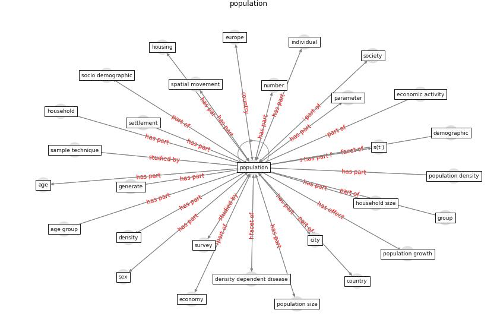

# Keyword: population

* [urban-city](cluster_Cluster_12)

* [malaria-vector](cluster_Cluster_13)

## Keywords

 * 0 4 year old, age, [age group](keyword_age_group), [area](keyword_area), average household size, build up area, [business](keyword_business), case control, cbg, census, [child](keyword_child), [city](keyword_city), congested urban areas, constructed bodies of water, contact network, contact rate, [country](keyword_country), county, [covid 19 pandemic](keyword_covid_19_pandemic), [danish](keyword_danish), [datum](keyword_datum), demand, demographic, demography, [density](keyword_density), density dependent disease, desa, difference between country, [disease](keyword_disease), economic activity, [economy](keyword_economy), educate, elderly, english, [epidemic](keyword_epidemic), [europe](keyword_europe), fatality, [flourish](keyword_flourish), [gate community](keyword_gate_community), generate, [globalisation](keyword_globalisation), grid cell, group, [health](keyword_health), healthcare service, [healthcare system](keyword_healthcare_system), high risk area, high school diploma, [household](keyword_household), household size, [housing](keyword_housing), [immigrant](keyword_immigrant), increase, individual, [infection](keyword_infection), [infectious disease](keyword_infectious_disease), [london](keyword_london), low income, migrant, mobility pattern, national, number, [occupant](keyword_occupant), operating characteristics, parameter, per capita, place of residence, [podgorica](keyword_podgorica), [population](keyword_population), population density, population distribution, population flow, population growth, population size, populous, populous household, poverty, public health agency, [sample](keyword_sample), sample size, sample technique, scatter plot, scientific research, settlement, sex, [society](keyword_society), socio demographic, statistical, sub group, sub population, subgroup, survey, the disease, total, [ug](keyword_ug), uninfected, urban area, urbanicity, [virus](keyword_virus), work age

## Concepts

 

## Neighbours

### Closest articles

* The Socio-Spatial Determinants of COVID-19 Diffusion: The Impact of Globalisation, Settlement Characteristics and Population - [LINK](article_sigler_socio-spatial_2020)
* Understanding the role of urban design in disease spreading - [LINK](article_brizuela_understanding_2019)
* Decision Making within the Built Environment as a Strategy for Mitigating the Risk of Malaria and Other Vector-Borne Diseases - [LINK](article_obonyo_decision_2018)
* The effect of occupant distribution on energy consumption and COVID-19 infection in buildings: A case study of university building - [LINK](article_mokhtari_effect_2021)
* Wastewater surveillance for population-wide Covid-19: The present and future - [LINK](article_daughton_wastewater_2020)
* Association of built environment attributes with the spread of COVID-19 at its initial stage in China - [LINK](article_li_association_2021)
* Treating two pandemics for the price of one: Chronic and infectious disease impacts of the built and natural environment - [LINK](article_frank_treating_2021)
* The impact of COVID-19 and strategies for mitigation and suppression in low- and middle-income countries - [LINK](article_walker_impact_2020)
* The Effects of Pandemic on Construction Industry in the UK - [LINK](article_shibani_effects_2020)
* Mental health economics: A prospective study on psychological flourishing and associations with healthcare costs and sickness benefit transfers in Denmark - [LINK](article_santini_mental_2021)

### Closest BPs

