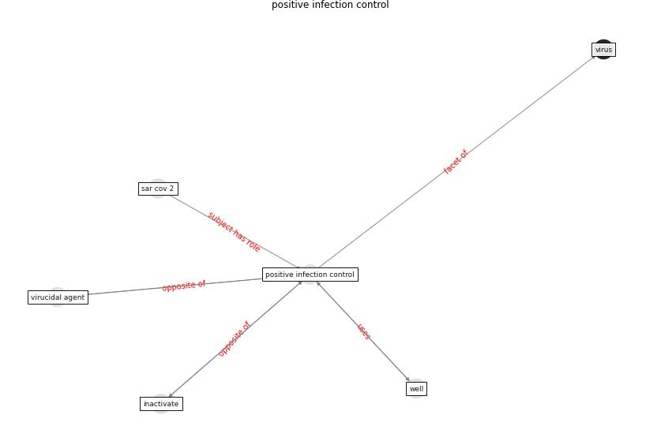

# Keyword: __positive infection control__

## Concepts

 

## Top articles for __positive infection control__
* Sars-CoV-2 (COVID-19) inactivation capability of
copper-coated touch surface fabricated by cold-spray
technology ([hutasoit_sars-cov-2_2020](article_hutasoit_sars-cov-2_2020))
