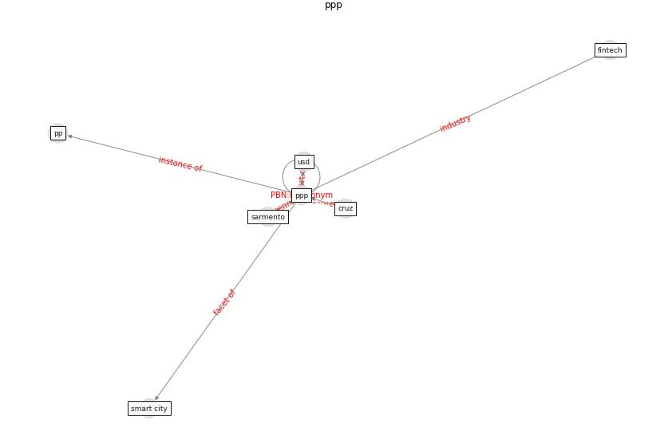

# Keyword: __ppp__
## Clusters

* Cluster 4: [smart-city](cluster_4)

## Concepts

 

## Top 10 articles for __ppp__
* The Emergence of Anti-Privacy and Control at the
Nexus between the Concepts of Safe City and Smart
City ([allam_emergence_2019](article_allam_emergence_2019))
* Mental health economics: A prospective study on
psychological flourishing and associations with healthcare
costs and sickness benefit transfers in Denmark ([santini_mental_2021](article_santini_mental_2021))
* Exploring the Non-Medical impacts of Covid-19 using
Natural Language Processing ([agade_exploring_2020](article_agade_exploring_2020))
* Future (post-COVID) digital, smart and sustainable
cities in the wake of 6G: Digital twins, immersive
realities and new urban economies ([allam_future_2021](article_allam_future_2021))
