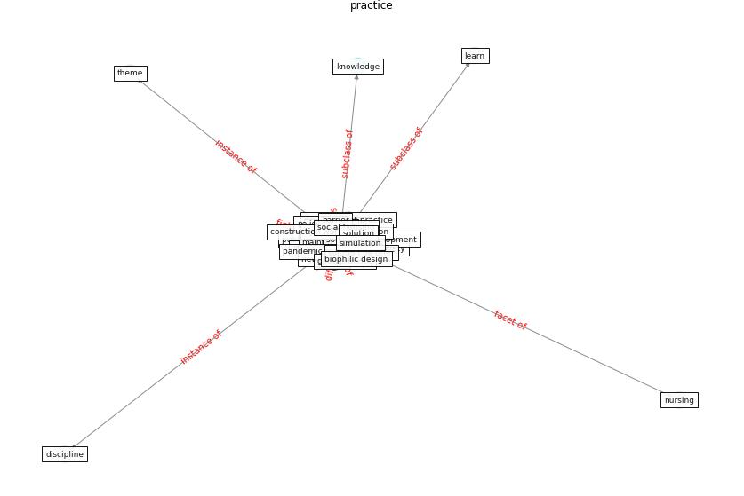

# Keyword: __practice__
## Clusters

* Cluster 2: [construction-resilience](cluster_2.md)

## Concepts

 

## Articles
* Amplifying the role of knowledge translation platforms in
the COVID-19 pandemic response ([el-jardali_amplifying_2020](article_el-jardali_amplifying_2020.md))
* Revisiting the built environment: 10 potential development
changes and paradigm shifts due to COVID-19 ([cheshmehzangi_revisiting_2021](article_cheshmehzangi_revisiting_2021.md))
* eurofund_sustainable_2016-100 ([eurofund_sustainable_2016-100](article_eurofund_sustainable_2016-100.md))
* Analysis of COVID-19 Concerns Raised by the
Construction Workforce and Development of
Mitigation Practices ([bou_hatoum_analysis_2021](article_bou_hatoum_analysis_2021.md))
* Towards Resilient Residential Buildings and
Neighborhoods in Light of COVID-19 Pandemic—The
Scenario of Podgorica, Montenegro ([bojovic_towards_2022](article_bojovic_towards_2022.md))
* Occupant health in buildings: Impact of the COVID-19
pandemic on the opinions of building professionals and
implications on research ([awada_occupant_2022](article_awada_occupant_2022.md))
* Navigating Climate Change: Rethinking the Role of
Buildings ([cole_navigating_2020](article_cole_navigating_2020.md))
* Coronavirus questions that will not go away: interrogating
urban and socio-spatial implications of COVID-19
measures ([salama_coronavirus_2020](article_salama_coronavirus_2020.md))
* Amplifying the role of knowledge translation platforms in
the COVID-19 pandemic response ([el-jardali_amplifying_2020](article_el-jardali_amplifying_2020.md))
* nassereddine_propositions_2021-200 ([nassereddine_propositions_2021-200](article_nassereddine_propositions_2021-200.md))
