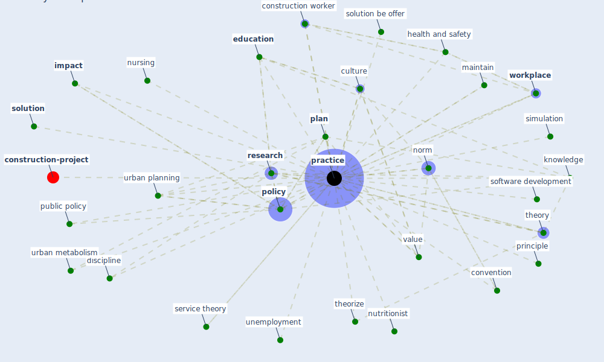

# Keyword: practice

* [construction-project](cluster_8)

## Keywords

 * Cluster_8, [adapt](keyword_adapt), [attitude](keyword_attitude), barrier, [biophilic design](keyword_biophilic_design), coercive control, coercivecontrol, [community](keyword_community), community of practice, [construction worker](keyword_construction_worker), convention, culture, development practice, discipline, [education](keyword_education), [evidence](keyword_evidence), futureˈsustainability, good practice, green space planning, [health and safety](keyword_health_and_safety), health education, hygiene, [impact](keyword_impact), [knowledge](keyword_knowledge), [learn](keyword_learn), maintain, modelling of public policy, new policy, norm, [nursing](keyword_nursing), nutritionist, pandemic management, [perspective](keyword_perspective), [plan](keyword_plan), planning theory, [policy](keyword_policy), policymake, [practice](keyword_practice), practice alignment, practices, principle, [public health](keyword_public_health), public policy, relevance, reopen safely, [research](keyword_research), [safety](keyword_safety), service theory, [simulation](keyword_simulation), software development, [solution](keyword_solution), solution be offer, [theme](keyword_theme), theorize, theory, unemployment, urban agriculture practices, urban metabolism, [urban planning](keyword_urban_planning), value, value creation, way of thinking, [workplace](keyword_workplace)

## Mapping

## Neighbours

### Closest articles

* How COVID-19 Could Accelerate the Adoption of New Retail Technologies and Enhance the (E-)Servicescape - [LINK](article_willems_how_2021)
* Amplifying the role of knowledge translation platforms in the COVID-19 pandemic response - [LINK](article_el-jardali_amplifying_2020)
* The Impact of COVID-19 on Public Space: A Review of the Emerging Questions - [LINK](article_honey-roses_impact_2020)
* Analysis of COVID-19 Concerns Raised by the Construction Workforce and Development of Mitigation Practices - [LINK](article_bou_hatoum_analysis_2021)
* Coronavirus questions that will not go away: interrogating urban and socio-spatial implications of COVID-19 measures - [LINK](article_salama_coronavirus_2020)
* Revisiting the built environment: 10 potential development changes and paradigm shifts due to COVID-19 - [LINK](article_cheshmehzangi_revisiting_2021)
* Addressing vulnerability, building resilience: community-based adaptation to vector-borne diseases in the context of global change - [LINK](article_bardosh_addressing_2017)
* Urban planning after COVID-19 - [LINK](article_rtpi_urban_2021)
* Sustainable work throughout the life course: National policies and strategies, Publications Office of the European Union - [LINK](article_eurofund_sustainable_2016)
* World Bank Development Report - [LINK](article_world_bank_world_2022)

### Closest BPs

