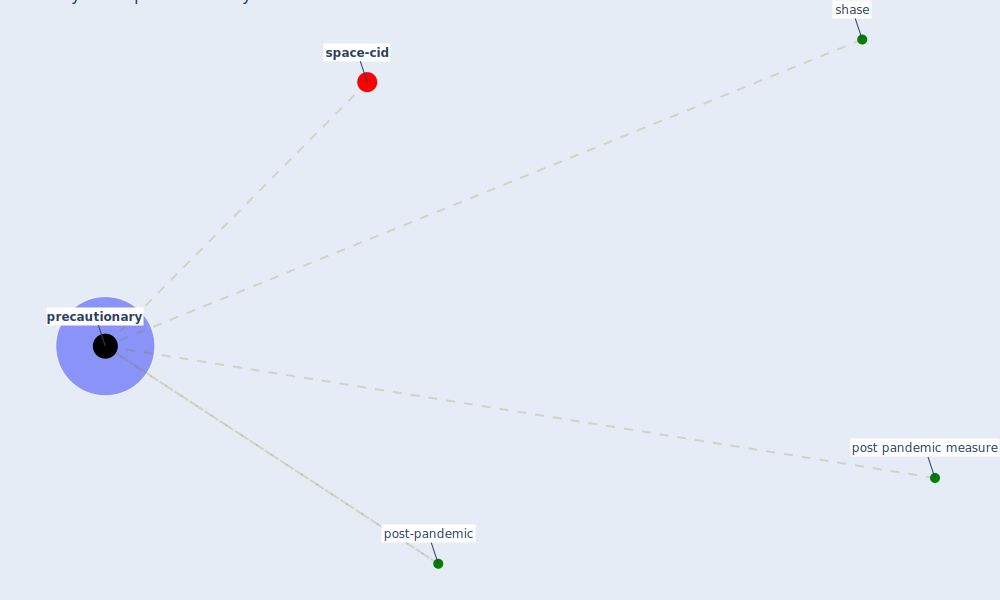

# Keyword: precautionary

* [space-cid](cluster_2)

## Keywords

 * Cluster_2, post pandemic measure, post-pandemic, [precautionary](keyword_precautionary), shase

## Mapping

## Neighbours

### Closest articles

* A critical review of heating, ventilation, and air conditioning (HVAC) systems within the context of a global SARS-CoV-2 epidemic - [LINK](article_elsaid_critical_2021)
* Assessment of COVID-19 precautionary measures in sports facilities: A case study on a health club in Saudi Arabia - [LINK](article_ibrahim_assessment_2022)

### Closest BPs

