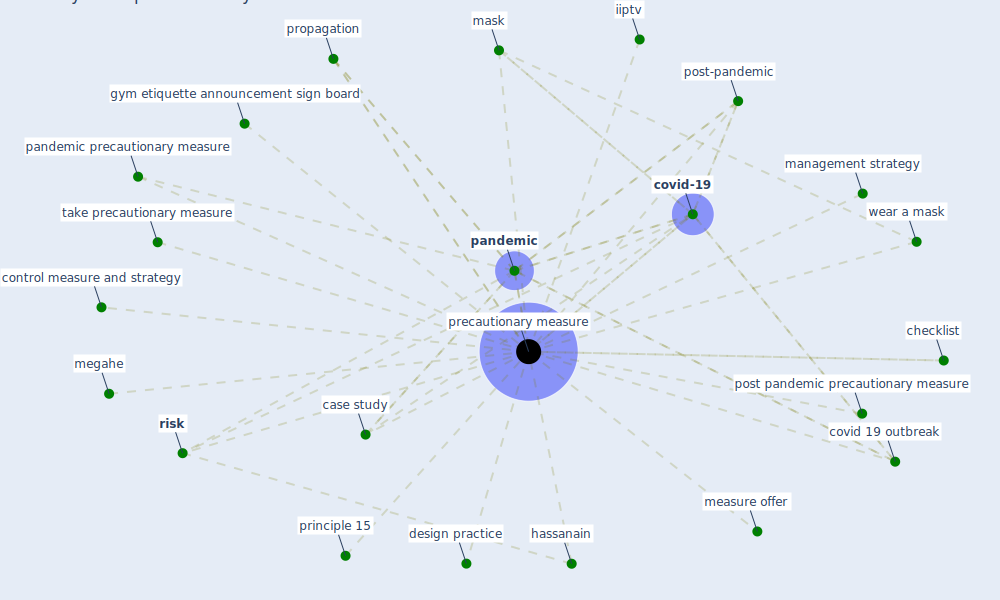

# Keyword: precautionary measure

## Keywords

 * case study, checklist, control measure and strategy, covid 19 outbreak, [covid-19](keyword_covid-19), design practice, gym etiquette announcement sign board, hassanain, iiptv, management strategy, [mask](keyword_mask), measure offer, megahe, [pandemic](keyword_pandemic), pandemic precautionary measure, post pandemic precautionary measure, post-pandemic, [precautionary measure](keyword_precautionary_measure), precautionary measures, principle 15, propagation, [risk](keyword_risk), take precautionary measure, wear a mask

## Mapping

## Neighbours

### Closest articles

* Assessment of COVID-19 precautionary measures in sports facilities: A case study on a health club in Saudi Arabia - [LINK](article_ibrahim_assessment_2022)
* Environmental factors involved in SARS-CoV-2 transmission: effect and role of indoor environmental quality in the strategy for COVID-19 infection control - [LINK](article_azuma_environmental_2020)
* An Automated System to Limit COVID-19 Using Facial Mask Detection in Smart City Network - [LINK](article_rahman_automated_2020)
* The impacts of knowledge, risk perception, emotion and information on citizens’ protective behaviors during the outbreak of COVID-19: a cross-sectional study in China - [LINK](article_ning_impacts_2020)
* Antivirus-built environment: Lessons learned from Covid-19 pandemic - [LINK](article_megahed_antivirus-built_2020)
* Recently employed engineering techniques to reduce the spread of COVID-19 (corona virus disease 2019): a review study - [LINK](article_saman_recently_2021)
* Impact of COVID-19 on IoT Adoption in Healthcare, Smart Homes, Smart Buildings, Smart Cities, Transportation and Industrial IoT - [LINK](article_umair_impact_2021)

### Closest BPs

