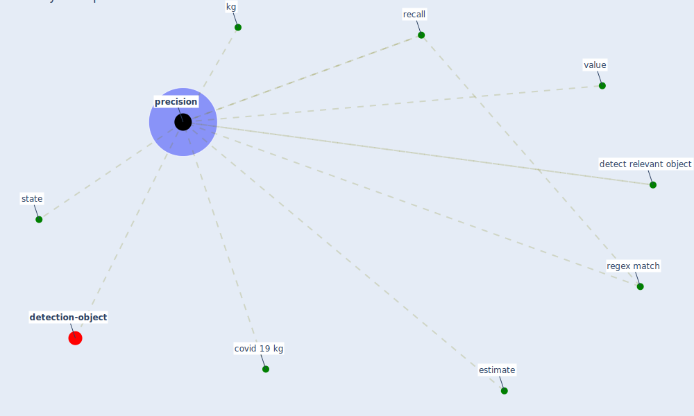

# Keyword: precision

* [detection-object](cluster_8)

## Keywords

 * Cluster_8, covid 19 kg, detect relevant object, estimate, [kg](keyword_kg), [precision](keyword_precision), recall, regex match, [state](keyword_state), value

## Mapping

## Neighbours

### Closest articles

* Towards the sustainable development of smart cities through mass video surveillance: A response to the COVID-19 pandemic - [LINK](article_shorfuzzaman_towards_2021)
* Construction of a Linked Data Set of COVID-19 Knowledge Graphs: Development and Applications - [LINK](article_wang_construction_2022)
* Mitigation strategies and compliance in the COVID-19 fight; how much compliance is enough? - [LINK](article_mukerjee_mitigation_2021)

### Closest BPs

