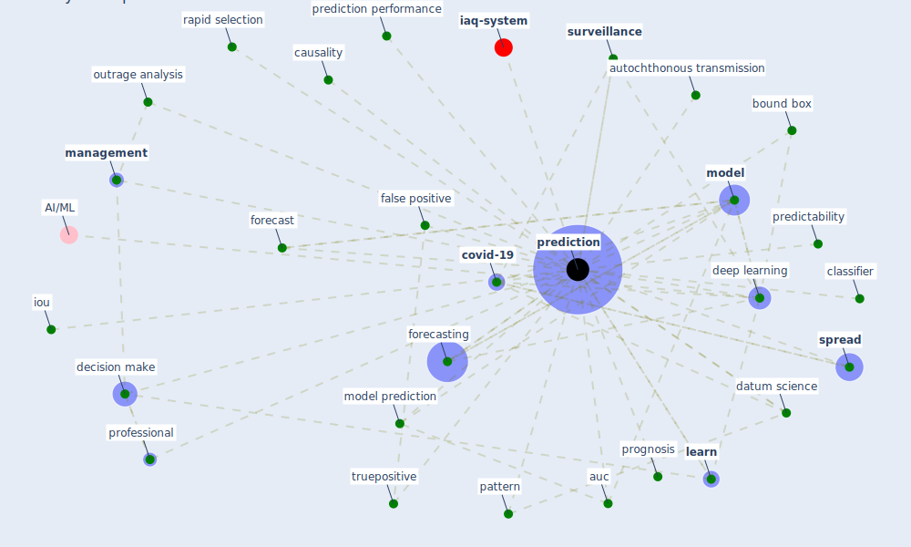

# Keyword: prediction

* [iaq-system](cluster_3)

## Keywords

 * 95 prediction envelopes, Cluster_3, auc, autochthonous transmission, [bound box](keyword_bound_box), causality, classifier, [covid-19](keyword_covid-19), datum science, decision make, [deep learning](keyword_deep_learning), [disease](keyword_disease), false, false incorrect prediction, false negative, false positive, forecast, forecasting, [iou](keyword_iou), [learn](keyword_learn), [management](keyword_management), [model](keyword_model), model prediction, outrage analysis, pattern, predictability, [prediction](keyword_prediction), prediction performance, predictions, [professional](keyword_professional), prognosis, rapid selection, [spread](keyword_spread), [surveillance](keyword_surveillance), truepositive

## Mapping

## Neighbours

### Closest articles

* Towards the sustainable development of smart cities through mass video surveillance: A response to the COVID-19 pandemic - [LINK](article_shorfuzzaman_towards_2021)
* Contributions of Smart City Solutions and Technologies to Resilience against the COVID-19 Pandemic: A Literature Review - [LINK](article_sharifi_contributions_2021)
* Ten questions concerning occupant health in buildings during normal operations and extreme events including the COVID-19 pandemic - [LINK](article_awada_ten_2021)
* Learning from pandemics: Applying resilience thinking to identify priorities for planning urban settlements - [LINK](article_syal_learning_2021)
* The efficacy of social distance and ventilation effectiveness in preventing COVID-19 transmission - [LINK](article_sun_efficacy_2020)
* Leveraging Digital Transformation Technologies to Tackle COVID-19: Proposing a Privacy-First Holistic Framework - [LINK](article_arpaci_leveraging_2021)
* Impact of COVID-19 on IoT Adoption in Healthcare, Smart Homes, Smart Buildings, Smart Cities, Transportation and Industrial IoT - [LINK](article_umair_impact_2021)
*  - [LINK](article_dalessandro_covid-19_2020)
* Digital Twin of COVID-19 Mass Vaccination Centers - [LINK](article_pilati_digital_2021)

### Closest BPs

